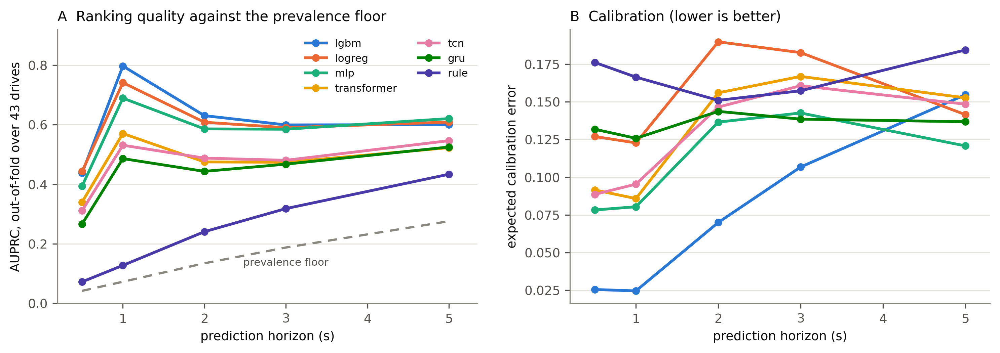
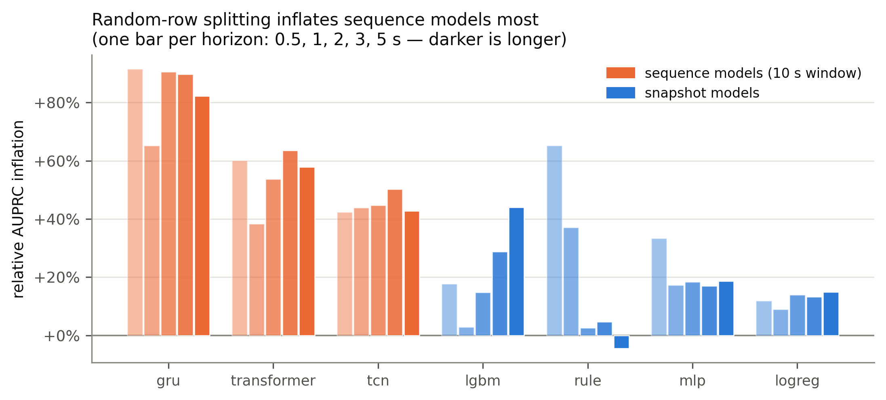
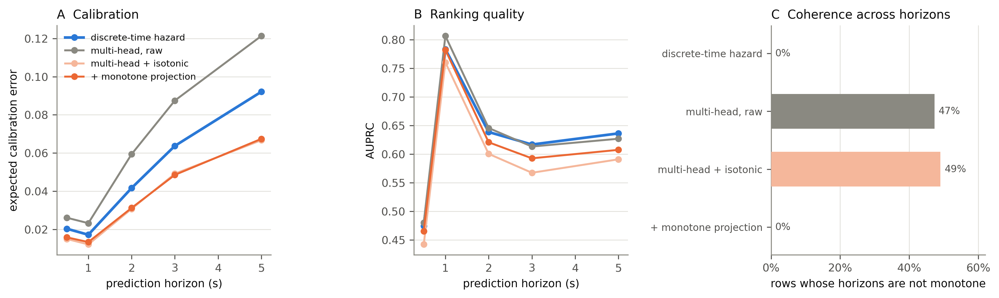
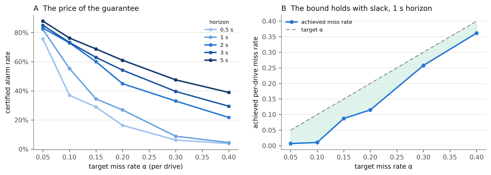
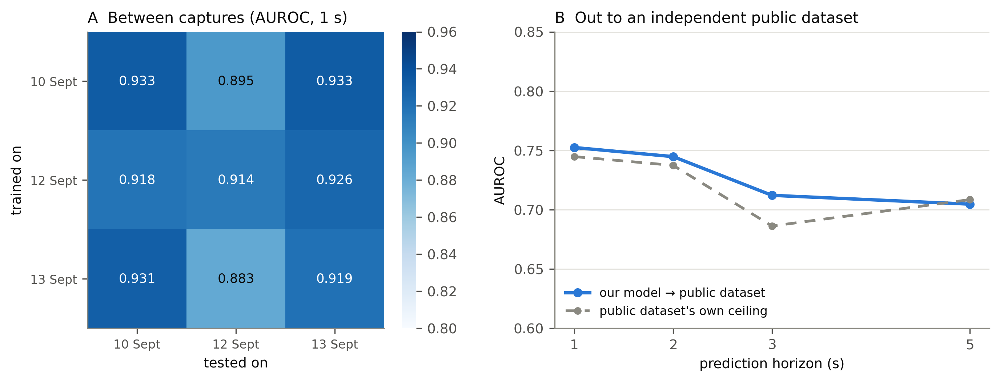
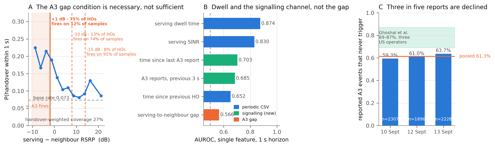
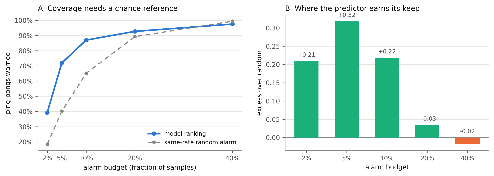

# Uncertainty-Aware Multi-Horizon Handover Prediction from Drive-Test Signalling

**Complete technical documentation — theory, method, results, reproduction.**
This document is self-contained. Every number in it comes from a table written
by a pipeline stage; the mechanism figure is regenerated by a stage from those
same tables, and the remaining figures are not yet behind one (§26).

Abeer Saadman · Islamic University of Technology, Gazipur, Bangladesh

---

## Contents

```
PART I — BACKGROUND AND METHOD
  1. Overview
  2. Radio measurements and the handover decision
       2.1 What the phone measures  ·  2.2 Event A3 and the procedure
       2.3 Why the rule is not a predictor
  3. The instrument: captures and signalling
  4. Signalling decoding and the configuration timeline
  5. Dataset construction
  6. Problem formalisation and labels
       6.1 Notation  ·  6.2 Multi-horizon binary form  ·  6.3 What is wrong
       6.4 Why a sub-sample-period horizon is labelable
  7. The discrete-time survival formulation
       7.1 Hazard, survival, incidence  ·  7.2 Likelihood with censoring
       7.3 Why class reweighting is forbidden
  8. Feature construction
       8.1 RF  ·  8.2 Mobility  ·  8.3 History  ·  8.4 Signalling + leakage guard
       8.5 Scaling
  9. Models
       9.1 A3 rule  ·  9.2 Logistic  ·  9.3 Gradient boosting  ·  9.4 MLP
       9.5 GRU / TCN / Transformer  ·  9.6 Training
 10. Calibration and monotone projection
 11. Evaluation protocol and metrics
       11.1 Grouping and the rotation  ·  11.2 Metrics  ·  11.3 Event level
       11.4 Cluster bootstrap  ·  11.5 Paired testing  ·  11.6 Tuning budget
 12. Distribution-free risk control
 13. Point-process analysis of ping-pong
 14. The benefit envelope

PART II — RESULTS
 15. Model comparison, with defaults and under an equal tuning budget
 16. Leakage is architecture-dependent
 17. The survival formulation, measured
 18. The risk-control frontier
 19. Transfer within, out of, and across the campaign — and what zero-cost
     domain adaptation costs
       19.1 Leave one capture out: a day, a corridor and a speed regime
       19.2 Between captures and out to an independent dataset
 20. Mechanism: why the A3 gap does not predict
 21. Report-conversion prediction
 22. Ping-pong as a self-exciting process, measured
 23. The benefit envelope, measured

PART III — SYNTHESIS
 24. Contributions
 25. Positioning against the literature
       25.1 The nearest comparator, reimplemented
       25.2 Methodological provenance, and two claims that narrow
 26. Reproducing everything
 27. Limitations
 28. Reference tables
 29. Notation and symbols
```

---

# PART I — BACKGROUND AND METHOD

## 1. Overview

A mobile network hands a phone from one cell to another using a rule that has
been in the standard since LTE: **3GPP event A3**, which fires when a
neighbour cell becomes better than the serving cell by a configured offset and
stays better for a configured time. The rule is reactive. It acts on
conditions that have already happened.

Everything downstream of a handover — the interruption, the throughput dip,
the ping-pong back to the cell just left — could be mitigated if the network
knew a handover was coming a second or two earlier. So the question is:

> **Given what a phone can observe right now, how well can the next handover
> be predicted, how far ahead, and with what guarantee?**

This work answers that on **57 drives across four measured campaigns** in
Dhaka — three urban corridors and one highway corridor at double the speed —
with handover ground truth taken from **decoded RRC signalling** rather than
inferred from serving-cell changes, and with each handover attributed to the
exact A3 profile that triggered it.

```
                 ┌──────────────────────────────┐
  XCAL wide CSV  │  1 Hz serving RF, GPS, speed │──┐
                 └──────────────────────────────┘  │
                                                   ▼
                 ┌──────────────────────────────┐ ┌──────────────────────┐
  RRC signalling │ measConfig · MeasurementRpt  │▶│ Configuration        │
  text export    │ HO commands · RLF            │ │ timeline (§4)        │
                 └──────────────────────────────┘ └──────────┬───────────┘
                                                             │
                              ┌──────────────────────────────┴──────────┐
                              ▼                                         ▼
                 ┌─────────────────────────┐              ┌──────────────────────┐
                 │ Labels  0.5/1/2/3/5 s   │              │ Features             │
                 │ + discrete hazard bins  │              │ RF·mobility·history  │
                 └────────────┬────────────┘              │ ·signalling          │
                              │                           └──────────┬───────────┘
                              └────────────┬──────────────────────────┘
                                           ▼
                              ┌──────────────────────────────┐
                              │ Grouped 5-fold rotation      │
                              │ every drive tested once      │
                              └──────────────┬───────────────┘
                                             ▼
                              ┌──────────────────────────────┐
                              │ AUPRC + prevalence floor     │
                              │ ECE · event rate · FA/hour   │
                              │ conformal risk control       │
                              └──────────────────────────────┘

  Invariants held everywhere:
    · grouping is by whole drive — never by row
    · scalers, thresholds and calibrators are fitted inside the fold
    · handover truth comes from signalling, not from serving-cell transitions
```

**Headline result.** Gradient boosting on snapshot radio and mobility features
reaches **AUROC 0.933 and AUPRC 0.784 at a 1 s horizon** — an 11.7× lift over
a 6.7% prevalence floor — out-of-fold across all 57 drives, with an expected
calibration error of 0.024. At the event level it warns of **44.7% of
handovers at 1 s and 65.1% at 5 s**. The ordering behind that number survives
giving every competing model the same tuning budget (§15).

**And it does not depend on the corridor.** The fourth capture (15 Sept) is a
highway run driven *after* every modelling decision was frozen. Adding it moved
pooled AUROC by zero. Held out whole — a day, a corridor and a speed regime
withheld from training — it is predicted at **AUROC 0.927 with the highest
prevalence-adjusted lift and the lowest calibration error of the four
captures** (§19.1).

---

## 2. Radio measurements and the handover decision

### 2.1 What the phone measures

Everything in the feature set descends from four physical-layer quantities
defined in 3GPP TS 36.214. Writing them down explicitly matters because their
units and their relationships constrain what a model can learn from them.

**RSRP — Reference Signal Received Power.** The linear average, over the
resource elements that carry cell-specific reference signals, of the received
power of one resource element:

```
                1    N_RE
   RSRP  =     ───    Σ    P_k          [W]  →  reported in dBm
               N_RE   k=1
```

Reported over −140 … −44 dBm in 1 dB steps. It is a *per-resource-element*
power, so it is independent of bandwidth — which is what makes it comparable
between cells on different carriers.

**RSSI — Received Signal Strength Indicator.** Total received wideband power
in the measurement bandwidth, including the serving cell, all interfering
cells, thermal noise, and everything else:

```
   RSSI  =  Σ ( P_serving + P_interference + P_noise )   over N_RB × 12 subcarriers
```

**RSRQ — Reference Signal Received Quality.** The ratio that turns the two
above into a load-and-interference-aware quality measure:

```
                 N_RB · RSRP
   RSRQ  =  ─────────────────────        reported in dB, range −19.5 … −3
                    RSSI
```

Because RSSI includes interference, RSRQ degrades when the cell gets busy even
if RSRP is unchanged. This is why RSRQ and RSRP carry different information
and why both are in the feature set.

**SINR — Signal to Interference plus Noise Ratio.**

```
                       S
   SINR  =  ──────────────────────       in dB
                   I  +  N
```

SINR is the quantity that maps most directly to achievable throughput through
the Shannon bound, `C = B log₂(1 + SINR)`, and it is the second-strongest
single predictor in this work (§20).

**The serving-to-neighbour gap** used throughout is defined with the
convention

```
   gap(t)  =  RSRP_serving(t)  −  RSRP_neighbour(t)        [dB]
```

so a **negative** gap means the neighbour is stronger. Every sign in §2.2 and
§8 follows from this convention; getting it backwards inverts the A3 firing
region entirely.

### 2.2 Event A3 and the handover procedure

3GPP TS 36.331 clause 5.5.4.4 defines event A3, "neighbour becomes offset
better than serving". The **entering condition** A3-1 is

```
   M_n + Of_n + Oc_n − Hys   >   M_p + Of_p + Oc_p + Off        (A3-1)
```

and the **leaving condition** A3-2 is

```
   M_n + Of_n + Oc_n + Hys   <   M_p + Of_p + Oc_p + Off        (A3-2)
```

where

| symbol | meaning | in these captures |
|---|---|---|
| `M_n`, `M_p` | measured RSRP of neighbour / serving (primary) cell, dBm | measured |
| `Of_n`, `Of_p` | frequency-specific offsets | 0 |
| `Oc_n`, `Oc_p` | cell-specific offsets | 0 |
| `Hys` | hysteresis, dB | 1–2 dB |
| `Off` | `a3-Offset`, signalled in **half-dB steps**, and may be negative | −15, −10, −6.5, +1, +2, +5 dB |

With the per-cell and per-frequency offsets at zero, A3-1 reduces to

```
   M_n − M_p  >  Off + Hys
```

and substituting the pipeline's `gap = M_p − M_n` gives the form used
everywhere in the code:

```
   ┌────────────────────────────────────────────┐
   │   A3 fires   ⟺   gap(t)  <  −( Off + Hys ) │
   └────────────────────────────────────────────┘
```

**The negation is the whole point.** This operator signals negative offsets,
so `−(Off + Hys)` can be strongly positive: for `Off = −10, Hys = 2` the rule
fires whenever `gap < +8 dB`, i.e. while the neighbour is still 8 dB *weaker*
than the serving cell. Thresholding at the raw offset instead of its negation
reverses which samples are inside the firing region.

**Time-to-trigger.** A3-1 alone does not cause a report. The condition must
hold *continuously* for `timeToTrigger` (TTT). Formally, a report is sent at
the first time `t` such that

```
   A3-1 holds for all  s ∈ [ t − TTT ,  t ]
```

so the relevant state variable is not the instantaneous gap but the **run
length** of the condition — which is exactly what the `sig_a3_hold_s` feature
in §8.4 measures.

**The full procedure**, with the timescales that matter here:

```
  UE                                    eNB (source)            eNB (target)
   │                                         │                       │
   │  A3-1 satisfied ──── TTT (160–640 ms) ──┤                       │
   │                                         │                       │
   ├── MeasurementReport ───────────────────▶│                       │
   │                                         ├── HO Request ────────▶│
   │                                         │◀── HO Request Ack ────┤
   │◀── RRCConnectionReconfiguration ────────┤   (HANDOVER COMMAND)  │
   │        ▲                                                        │
   │        │ this message is the ground-truth event in this work    │
   │        │ timestamped to the millisecond, carries target PCI,    │
   │        │ target EARFCN and the T304 timer                       │
   │                                                                 │
   ├── detach, sync to target, RACH ────────────────────────────────▶│
   ├── RRCConnectionReconfigurationComplete ────────────────────────▶│
   │        └─ interruption time = this − command  (median ≈ 1 ms … 100 ms)
```

The report-to-command interval is typically 50–200 ms — **inside one sample
period of a 1 Hz log**. That single fact drives the leakage guard in §8.4.

### 2.3 Why the rule is not a predictor

Three properties of the procedure above make the deployed rule a poor
predictor of its own outcome, and all three are measured in §20.

1. **The entering condition is a low bar.** Weighted by each profile's share
   of handovers, A3-1 is satisfied on only 27.1% of samples — but conditional
   on it being satisfied, a handover follows within 1 s only about 20% of the
   time. It is *necessary but far from sufficient*.
2. **TTT is a filter the instantaneous gap cannot express.** Two samples with
   identical gaps are in different states if one has held the condition for
   300 ms of a 320 ms TTT and the other has just crossed.
3. **The network is free to decline.** A measurement report is a request, not
   a decision. 61.3% of reported A3 events in this data are never followed by
   a handover command.

A learned predictor is therefore not competing with a rule that already knows
the answer; it is estimating a conditional probability the rule never
computes.

---

## 3. The instrument: captures and signalling

Four drive-test campaigns were run over urban corridors and a northern highway corridor in Dhaka and Gazipur with an
XCAL-equipped handset, each producing two synchronised exports. Full physical corridor details and highway speed profiles are documented in [Report 23](file:///D:/Handover%20Thesis/23-sept15-highway-validation-and-cross-campaign.md).

| capture | samples | drives | handovers | duration |
|---|---|---|---|---|
| 10 Sept — urban arterial | 2,700 | 15 | 290 | ~46 min |
| 12 Sept — urban loop | 1,440 | 8 | 174 | ~24 min |
| 13 Sept — dense urban | 3,600 | 20 | 297 | ~60 min |
| **15 Sept — highway** | **2,520** | **14** | **177** | **~43 min** |
| **pooled** | **10,260** | **57** | **938** | **~2.9 h / 95 km** |

The four logs contain 957 signalling-confirmed handovers; 938 of them fall
inside a drive that passes quality control and are the set every model is
scored against. Both numbers appear in the literature-facing documents, so the
manuscript always says which it means.

**Export 1 — the wide CSV.** A regular 1 Hz grid carrying serving-cell RSRP,
RSRQ, RSSI, SINR, CQI, PCI, EARFCN, band, cell identity, RRC state, PHY
throughput, GPS position and speed.

**Export 2 — the RRC signalling text log.** Roughly 30 MB per capture of
decoded control-plane messages: every `measConfig` reconfiguration, every
`MeasurementReport` with its measured neighbours, every handover command with
its target cell and T304 timer, and every re-establishment.

The signalling export is what makes the work possible, for three reasons.

1. **Ground truth.** A handover command is an explicit, timestamped, decoded
   message carrying the target cell and the interruption time. Its timestamp
   is precise to the millisecond while the sample grid is 1 Hz — a distinction
   that becomes a contribution in §6.4.
2. **Neighbour measurements.** The wide CSV's neighbour columns are sparsely
   populated; the signalling log's `MeasurementReport` bodies are not.
   Projecting reported neighbours onto the sample grid raises neighbour
   coverage to **62–79%** of samples, with a median report age of 0.36 s.
3. **The deployed rule itself.** `measConfig` messages carry the operator's
   own A3 offsets, hysteresis values and TTT settings, so the rule the network
   is running is *measured*, not assumed.

Parser validation: on an independent public drive-test dataset the same parser
agrees **310/310** with the vendor tool's own event counter.

---

## 4. Signalling decoding and the configuration timeline

### 4.1 The attribution chain

To learn what event a `MeasurementReport` signals and under what thresholds,
the standard requires following a chain of indirections:

```
   MeasurementReport.measId
        │
        ▼
   measIdToAddModList   →   measObjectId  +  reportConfigId
                                  │                 │
                                  ▼                 ▼
                          carrier EARFCN    reportConfigToAddModList
                                                    │
                                                    ▼
                                      eventId ∈ {A1…A6},
                                      a3-Offset, hysteresis,
                                      timeToTrigger, reportInterval
```

### 4.2 Why a flat parse is wrong

**`measId` and `reportConfigId` are message-scoped indices, not global
identifiers.** `measConfig` is *incremental*: a `...ToAddModList` element
inserts a new entry **or replaces an existing one at the same index**. The
same numeric id therefore denotes different objects at different times in one
log. Measured in these captures:

- roughly **1,060 `measConfig` updates per capture**
- **29 of 30** report-config ids denote a different event type at some later
  point in the same log
- every `measId` points at several different configurations over time

A parser that flattens the file into one dictionary resolves every report
against whichever definition happened to be parsed last. The symptom is not an
error but a plausible-looking, wrong answer.

### 4.3 The timeline

The fix is to treat the configuration as a piecewise-constant function of time
and to replay the log in order, accumulating state:

```
   S(t)  =  ⋃  Δ_i          over all measConfig messages with  t_i ≤ t
           i

   where each Δ_i is an (add ∪ modify) applied to the previous state
```

Implemented as an ordered array of snapshot states with binary search:

```python
@dataclass
class RegimeMaps:
    times:  list[pd.Timestamp]      # ascending
    states: list[dict]              # {"meas_id":…, "report_config":…, "carrier":…}

    def at(self, t):                # O(log n)
        i = searchsorted(self.times, t, side="right") - 1
        return self.states[i] if i >= 0 else EMPTY
```

Each report is resolved against `maps.at(t)` — the configuration in force at
*its own* timestamp. A handover is then attributed to the A3 profile of the
most recent A3 report within a 5 s tolerance before it.

**Result.** Reports resolve to a configuration 99.7% of the time with a
plausible event mix (44.5% A3, 27.7% A1, 5.3% A5, 3.4% A4, 2.0% A2), and
**95-97% of the 938 handovers are attributed to the exact A3 profile that fired
them.**

### 4.4 The deployed configuration

The operator runs several A3 profiles concurrently. Pooled over the three
captures, three clear a 30-handover bar:

| A3 profile | share of handovers | fires when gap < −(Off+Hys) |
|---|---|---|
| **Off +1 dB, Hys 1 dB, TTT 320 ms** | **74.6%** | **−2 dB** |
| Off −10 dB, Hys 2 dB, TTT 640 ms | 13.1% | +8 dB |
| Off −15 dB, Hys 1 dB, TTT 160 ms | 7.7% | +14 dB |

Two are **negative** offsets — the network hands over while the neighbour is
still weaker — and the shortest TTT is 160 ms. Both are aggressive settings,
both are verifiable from the signalling, and together they explain the high
ping-pong rate in §22.

---

## 5. Dataset construction

```
raw XCAL CSV ──▶ ingest ──▶ resample to a uniform 1 Hz grid
                              │
signalling log ──▶ parse ─────┤ merge neighbours (median report age 0.36 s)
                              │ substitute signalling handovers as the event source
                              ▼
                        route assignment
                              │
                              ▼
                   drive segmentation (180 s blocks)
                              │
                              ▼
                   quality control per drive
                              │  reject if:  T_d < 60 s
                              │              N_d < 60 samples
                              │              missingness(core RF) > 0.25
                              ▼
                        57 drives retained
```

**Resampling.** Samples are placed on a uniform grid of period `Δ = 1 s`.
Gaps shorter than `3Δ` are linearly interpolated and flagged with a per-field
mask; longer gaps are left as holes. Synthesised rows are 0.04% of the total
and every model sees the mask columns, so imputation cannot be silently
mistaken for measurement.

**Drive segmentation.** The captures are continuous sessions, not discrete
drives, so each session is cut into fixed 180 s blocks. This matters only
because it defines the **grouping unit** `d ∈ D` for every split in §11. The
blocks are long enough to contain multiple handovers (median ≈ 18 per drive)
and short enough that 43 of them exist.

**Quality control.** A drive `d` is retained iff

```
   T_d ≥ 60 s   ∧   N_d ≥ 60   ∧   max_{f ∈ core}  miss_f(d)  ≤  0.25
```

with `core = {serving_rsrp, serving_rsrq}`. One drive of 44 was rejected.

**Drive identity.** Drive ids are prefixed with the capture tag before
pooling. Without this, per-capture drive numbering collides across captures
and grouped splits leak — a failure that shows up as an implausibly high
pooled AUROC rather than as an error.

---

## 6. Problem formalisation and labels

### 6.1 Notation

| symbol | meaning |
|---|---|
| `d ∈ D` | a drive; `\|D\| = 43` |
| `t` | sample time on the 1 Hz grid, `Δ = 1 s` |
| `x_t ∈ ℝ^p` | feature vector at sample `t`, `p = 107` after filtering |
| `H = {h_1 … h_K}` | horizons, `{0.5, 1, 2, 3, 5}` s, `K = 5` |
| `T_t` | time from `t` to the next handover (continuous, from signalling) |
| `C_t` | time from `t` to the end of the drive (censoring time) |
| `y_t^{(k)}` | binary label at horizon `h_k` |
| `m_t^{(k)}` | mask: is the label at horizon `h_k` defined for this sample |
| `π_k` | marginal prevalence at horizon `h_k` |

### 6.2 The multi-horizon binary formulation

The conventional statement of the task is `K` independent binary problems:

```
   y_t^{(k)}  =  1{ T_t ≤ h_k }
```

with the mask excluding samples whose horizon runs past the end of the drive
and samples inside a 2 s blanking window after a handover:

```
   m_t^{(k)}  =  1{ C_t ≥ h_k }  ·  1{ t − t_last_HO > 2 s }  ·  1{ x_t valid }
```

The blanking window is not cosmetic: the second after a handover is dominated
by the RRC reconfiguration itself, so a model trained on it learns to detect
handovers it has already seen rather than to predict the next one.

| horizon | labelable samples | prevalence `π_k` |
|---|---|---|
| **0.5 s** | 6,362 | **0.0423** |
| 1 s | 6,362 | 0.0732 |
| 2 s | 6,327 | 0.1356 |
| 3 s | 6,292 | 0.1890 |
| 5 s | 6,219 | 0.2771 |

### 6.3 What is wrong with it

Fitting `K` independent models `f_k(x) ≈ P(T ≤ h_k | x)` discards three facts
that are true by construction:

1. **Monotonicity.** Since `{T ≤ h_1} ⊆ {T ≤ h_2} ⊆ …`, any coherent
   probability assignment must satisfy
   `P(T≤h_1|x) ≤ P(T≤h_2|x) ≤ … ≤ P(T≤h_K|x)`. Nothing enforces it, and §17
   measures 43.6% of rows violating it.
2. **Censoring.** A sample whose drive ends before `h_k` is simply dropped
   from head `k`, discarding the information that it survived up to `C_t`.
3. **Shared strength.** The five heads estimate five functionals of the same
   conditional distribution and share no parameters.

### 6.4 A sub-sample-period horizon is labelable

A 0.5 s horizon on a 1 Hz grid looks impossible, and with a
transition-derived event log it would be. The resolution is that the **event
clock and the sample clock are different clocks**.

Let the sample times be `t ∈ {0, Δ, 2Δ, …}` with `Δ = 1 s`, and let the
handover times be `{τ_j}` observed to a precision `δ ≪ Δ`. The label

```
   y_t^{(0.5)}  =  1{ T_t ≤ 0.5 }  =  1{ min_j (τ_j − t)_+  ≤  0.5 }
```

is well defined whenever `δ ≤ 0.5 s`, regardless of `Δ`. Here `δ = 1 ms`,
verified as 100% of events, so it is well defined.

The sanity check is the prevalence ratio. If handover arrivals are locally
uniform at rate `λ`, then `P(T ≤ h) ≈ λh` for small `h`, so

```
   π_{0.5} / π_{1.0}  ≈  0.5
```

Measured: `0.0423 / 0.0732 = 0.578`. Slightly above 0.5, as expected from
positive dependence near an event, and nowhere near 0 or 1.

**What the 1 Hz grid *does* bound** is event *detection*. Two handovers closer
together than one sample period cannot both be marked on the grid. Empirically
10.1% of consecutive handovers are less than `Δ` apart, so

```
   max event detection rate  =  1 − 0.101  =  0.905
```

Every event-level number in Part II is read against this **90.5% ceiling**.
The distinction — the grid bounds detection, the event clock bounds horizon
resolution — is not drawn in the literature.

---

## 7. The discrete-time survival formulation

**This formulation is borrowed, and borrowed from a mature literature.**
Wiegrebe et al. (2024) review 61 deep time-to-event methods and place the
discrete-time route — binary indicators per interval, trained as classification
— firmly in the mainstream; Thorsen-Meyer et al. (2022) build structurally the
same object in intensive care, with a censoring-aware log-likelihood over
discretised windows. Nothing below is new as *statistics*. What is new is where
it is pointed: no handover-prediction paper in the 22-paper audit of §25 poses
the task this way, and every one of them therefore inherits the incoherence
that §6.3 describes.

One departure from that literature is deliberate and is defended in §11.2. It
evaluates with the C-index and the integrated Brier score, both of which
aggregate over the horizon axis. An operator acts at **one** horizon, so §11
reports horizon-wise AUPRC together with a coherence-violation rate instead.

### 7.1 Hazard, survival, incidence

Partition the time axis into `K` bins whose upper edges are exactly the
horizons of interest:

```
   B_1 = (0, h_1] ,  B_2 = (h_1, h_2] , … ,  B_K = (h_{K−1}, h_K]
```

Define the **discrete-time hazard** — the probability that the event falls in
bin `k`, given that it has not yet occurred by the start of bin `k`:

```
   λ_k(x)  =  P( T ∈ B_k  │  T > h_{k−1} ,  x )                      (1)
```

The **survival function** is the product of per-bin survivals:

```
                k
   S_k(x)  =   ∏  ( 1 − λ_j(x) )      =   P( T > h_k │ x )           (2)
               j=1
```

and the quantity the task actually asks for, the **cumulative incidence**, is
its complement — the **product-limit identity**:

```
   ┌──────────────────────────────────────────────────────────┐
   │                            k                             │
   │   F_k(x) = P(T ≤ h_k │ x) = 1 − ∏ ( 1 − λ_j(x) )         │   (3)
   │                           j=1                            │
   └──────────────────────────────────────────────────────────┘
```

**Monotonicity is now a theorem, not a hope.** Since `λ_j ∈ [0,1]`, every
factor `(1 − λ_j) ∈ [0,1]`, so `S_k` is non-increasing in `k` and therefore
`F_k = 1 − S_k` is non-decreasing:

```
   S_{k+1} = S_k · (1 − λ_{k+1})  ≤  S_k     ⟹     F_{k+1} ≥ F_k     ∎
```

This holds for **any** learner that outputs `λ_j ∈ [0,1]`, which is why the
coherence result in §17 is learner-independent while the calibration result is
not.

### 7.2 The likelihood with censoring

Let `k_t` be the bin in which the event occurs for sample `t`, and let `c_t`
be the last bin fully survived before censoring. The discrete-time survival
log-likelihood is

```
              ⎡ k_t−1                                          ⎤
   ℓ_t  =  log⎢  ∏  (1 − λ_j(x_t))  ·  λ_{k_t}(x_t)            ⎥   (uncensored)
              ⎣ j=1                                            ⎦

              ⎡ c_t                    ⎤
   ℓ_t  =  log⎢  ∏  (1 − λ_j(x_t))     ⎥                          (censored)
              ⎣ j=1                    ⎦
```

Both cases collapse into one expression. Define for each sample an **at-risk
set** `R_t = {1 … min(k_t, c_t)}` — the bins the sample entered — and a
per-bin indicator `z_{t,k} = 1{ k = k_t }`. Then

```
                             ⎡                                              ⎤
   ℓ  =  Σ    Σ              ⎢ z_{t,k} log λ_k(x_t) + (1−z_{t,k}) log(1−λ_k)⎥   (4)
          t  k ∈ R_t         ⎣                                              ⎦
```

**Equation (4) is exactly a binary cross-entropy over the expanded set of
(sample × at-risk bin) pairs.** That is the key practical consequence: fitting
a discrete-time survival model requires no special software. Expand the data
into long format,

```
   original:  (x_t , T_t , C_t)                       N     = 10,260 rows
   long:      (x_t , k , z_{t,k})  for k ∈ R_t        N_long ≈ 34,000 rows
```

append the bin index `k` as a feature so the model can learn a baseline hazard
shape, and fit **one** binary classifier. A censored sample contributes
`(1 − λ_k)` terms for every bin it survived rather than being discarded.

Measured per-bin hazard rates on this data (pooled over folds):

```
   λ̄_1 (0 – 0.5 s) = 0.053     λ̄_4 (2 – 3 s) = 0.072
   λ̄_2 (0.5 – 1 s) = 0.042     λ̄_5 (3 – 5 s) = 0.123
   λ̄_3 (1 – 2 s)   = 0.086
```

### 7.3 Why class reweighting is forbidden here

A standard reflex on an imbalanced task is `scale_pos_weight` or
`is_unbalance`. It must not be used in the hazard arm, for a reason specific
to equation (3).

Reweighting the positive class by `w` transforms the fitted probability
monotonically,

```
   λ̃  =  w λ / ( w λ + (1 − λ) )
```

Ranking metrics are invariant to this — AUPRC and AUROC depend only on the
order of scores — but the **probability scale is destroyed**, and equation (3)
multiplies `K` of those probabilities together. A per-bin multiplicative
calibration error `ε` compounds as

```
   F̂_k / F_k  ~  (1 + ε)^k
```

so the distortion grows with the horizon. Both arms in §17 are therefore
fitted unweighted, which also keeps the comparison fair.

---

## 8. Feature construction

152 columns are built; 107 survive a degenerate-feature filter (zero variance
or >50% missing on training rows) and enter the models. They form four blocks
that can be ablated independently.

### 8.1 RF block (83 features)

For each base field `f ∈ {RSRP, RSRQ, RSSI, SINR, CQI}` and each rolling
window `w ∈ {3, 5, 10}` s, with `n_w = w/Δ` samples:

```
   mean:        μ_f,w(t)  =  (1/n_w) Σ_{i=0}^{n_w−1} f(t − iΔ)

   std:         σ_f,w(t)  =  sqrt( (1/n_w) Σ ( f(t−iΔ) − μ_f,w(t) )² )

   first diff:  Δ¹_f(t)   =  f(t) − f(t − Δ)

   second diff: Δ²_f(t)   =  f(t) − 2f(t−Δ) + f(t−2Δ)

   range:       r_f,w(t)  =  max − min over the window
```

All windows are **backward-looking and closed at `t`**, so no feature sees the
future. Neighbour features use the top `k = 3` reported neighbours:

```
   gap_j(t)        =  RSRP_serving(t) − RSRP_nbr_j(t) ,   j = 1,2,3
   gap_best(t)     =  RSRP_serving(t) − max_j RSRP_nbr_j(t)
   nbr_spread(t)   =  max_j RSRP_nbr_j(t) − min_j RSRP_nbr_j(t)
```

plus a missingness mask `1{f(t) observed}` per field, kept as a feature so the
model can condition on measurement availability rather than on an imputed
value.

### 8.2 Mobility block (17 features)

```
   speed v(t)                      from GPS, km/h
   acceleration a(t) = Δv/Δ
   heading θ(t) = atan2(Δlat, Δlon)
   heading change |θ(t) − θ(t−Δ)| wrapped to (−π, π]
   along-track coordinate s(t), its rate, and distance travelled in the drive
```

The along-track coordinate projects the GPS trace onto the corridor's
principal axis, so it is comparable between drives in either direction.

### 8.3 History block (7 features)

The strongest block in the study, and the cheapest.

```
   serving dwell time      D(t) = t − t_attach(serving cell)      clipped at 180 s
   log dwell               log(1 + D(t))
   time since previous HO  t − τ_{last}
   handover count so far   |{ τ_j : τ_j < t , same drive }|
   previous target PCI, and whether it equals the current serving PCI
```

`D(t)` alone reaches AUROC 0.874 at the 1 s horizon (§20). Intuitively it is a
sufficient statistic for a renewal-like process: the longer the phone has been
attached, the further it has travelled inside the current cell's footprint.

### 8.4 Signalling block (13 features) and its leakage guard

Three quantities the control plane exposes and the periodic CSV does not.

**(a) The A3 hold time — a TTT clock.** From §2.2, the rule cares about the
run length of A3-1, not its instantaneous value. Define

```
   a(t)  =  1{ gap(t) < −( Off(t) + Hys(t) ) }         using maps.at(t)

                ⎧ 0                       if a(t) = 0, or new drive,
   hold(t)  =   ⎨                            or a(t−Δ) = 0
                ⎩ hold(t−Δ) + Δ           otherwise

   holdfrac(t)  =  hold(t) / TTT(t)           clipped to [0, 10]
```

`holdfrac ≥ 1` means the condition has been satisfied for at least the full
time-to-trigger, which is precisely the state in which a report is due.

**(b) Measurement-report history.** Counts of reports in earlier bins, for
window lengths `w ∈ {1, 2, 3, 5}` s:

```
   n_w(t)  =  | { report times r  :  t − w  <  r  ≤  t − Δ } |
```

separately for all events and for A3 only, plus `t − max{r : r ≤ t − Δ}`, the
time since the last A3 report.

**⚠ The leakage guard is the upper limit `t − Δ`, not `t`.** From §2.2, a
report precedes its handover command by 50–200 ms, which is *inside* one
sample. A feature counting reports in the current bin would be reading the
outcome, not predicting it. The window is therefore the half-open interval
`(t − w, t − Δ]`, which also makes consecutive windows tile without
double-counting a report on a bin boundary. Seven unit tests pin this,
including the exact-boundary case and the drive-boundary reset.

**(c) RF slopes.** Backward differences over `w ∈ {3, 5}` s, per drive:

```
   ḟ_w(t)  =  ( f(t) − f(t − w) ) / w          [dB/s]
```

for `f ∈ {RSRP, SINR, RSRQ, gap}`, with `NaN` at drive boundaries so no slope
crosses a drive.

### 8.5 Scaling

A **robust scaler** is fitted on training rows only, per fold:

```
   x̃_j  =  clip(  ( x_j − median(x_j) ) / IQR(x_j) ,  −8 , +8  )
```

Median and IQR rather than mean and standard deviation, because RF
distributions have heavy tails at cell edges; the ±8σ clip prevents a single
dropout sample from dominating a tree split or a gradient step.

---

## 9. Models

Seven models span rule-based, linear, tree-ensemble and three sequence
architectures. All produce `K` outputs, one per horizon, except where noted.

### 9.1 A3 rule baseline

The deployed logic, reimplemented as a predictor:

```
   ŷ_rule(t)  =  1{ gap(t) < g }  ·  1{ ġ_3(t) < τ }      g = 2 dB,  τ = −1 dB/s
```

It scores as a degenerate probability (0/1 with a small margin term). Its role
is to answer "does a learned model beat the rule that is already deployed?"

### 9.2 Logistic regression

```
   P(y=1 | x)  =  σ( wᵀx + b ) ,        σ(z) = 1 / (1 + e^{−z})
```

fitted per horizon by L2-penalised maximum likelihood with balanced class
weights:

```
   min_w   Σ_i  c_{y_i} · log(1 + exp(−ỹ_i (wᵀx_i + b)))  +  (1 / 2C) ‖w‖²
```

with `C = 1`, `ỹ ∈ {−1, +1}`, `c_y = N / (2 N_y)`. It is the reference for
"how much of this is non-linear?"

### 9.3 Gradient-boosted trees (LightGBM) — the primary model

An additive ensemble of regression trees fitted by second-order boosting.
At iteration `m` the objective is

```
   L^{(m)}  =  Σ_i  ℓ( y_i , ŷ_i^{(m−1)} + f_m(x_i) )  +  Ω(f_m)
```

Taking a second-order Taylor expansion about `ŷ^{(m−1)}` with

```
   g_i = ∂ℓ/∂ŷ  ,      h_i = ∂²ℓ/∂ŷ²
```

and dropping constants gives the tractable surrogate

```
   L̃^{(m)}  ≈  Σ_i [ g_i f_m(x_i) + ½ h_i f_m(x_i)² ]  +  γ T  +  ½ λ Σ_j w_j²
```

For a fixed tree structure with leaves `j = 1…T` and instance sets `I_j`, the
optimal leaf weight and the resulting gain follow in closed form:

```
                 Σ_{i∈I_j} g_i                              1      ( Σ_{i∈I_j} g_i )²
   w_j*  =  −  ──────────────────           L̃*  =  − ───  Σ  ────────────────────────  + γT
               Σ_{i∈I_j} h_i + λ                        2    j    Σ_{i∈I_j} h_i + λ
```

and a split is accepted only if it improves this by more than `γ`:

```
              1 ⎡  G_L²        G_R²        (G_L+G_R)²  ⎤
   Gain  =   ─── ⎢ ───────  +  ───────  −  ─────────── ⎥  −  γ
              2 ⎣ H_L+λ       H_R+λ       H_L+H_R+λ    ⎦
```

For logistic loss, `g_i = p_i − y_i` and `h_i = p_i(1 − p_i)`.

LightGBM adds **leaf-wise growth** (expand the leaf with the largest gain
rather than growing level by level), **histogram binning** of features, and
**exclusive feature bundling**. Hyper-parameters, fixed across all
experiments:

| parameter | multi-horizon arm | hazard arm |
|---|---|---|
| boosting rounds | 600 | 400 |
| learning rate `η` | 0.05 | 0.05 |
| `num_leaves` | 63 | 31 |
| `min_data_in_leaf` | 50 | 40 |
| feature fraction | 0.8 | 0.8 |
| bagging fraction / freq | 0.8 / 1 | 0.8 / 1 |
| L2 penalty `λ` | 1.0 | 1.0 |
| class weighting | balanced | **none** (see §7.3) |

### 9.4 Multi-layer perceptron

```
   h^{(1)} = Dropout( ReLU( W_1 x + b_1 ) )          W_1 ∈ ℝ^{128×p}
   h^{(2)} = Dropout( ReLU( W_2 h^{(1)} + b_2 ) )    W_2 ∈ ℝ^{64×128}
   ŷ       = σ( W_3 h^{(2)} + b_3 )                  W_3 ∈ ℝ^{K×64}
```

dropout 0.2, AdamW, lr 1e-3, weight decay 1e-4.

### 9.5 Sequence models

All three consume a window `X_t = [x_{t−L+1} … x_t] ∈ ℝ^{L×p}` with
`L = 10` samples (10 s) and stride 1, and predict all `K` horizons from the
final position.

**GRU** — hidden 96, 2 layers, dropout 0.2:

```
   z_t = σ( W_z x_t + U_z h_{t−1} )                     update gate
   r_t = σ( W_r x_t + U_r h_{t−1} )                     reset gate
   h̃_t = tanh( W_h x_t + U_h ( r_t ⊙ h_{t−1} ) )
   h_t = ( 1 − z_t ) ⊙ h_{t−1}  +  z_t ⊙ h̃_t
```

**TCN** — three dilated causal convolution blocks, 64 channels, kernel 3,
dilations 1, 2, 4, with residual connections:

```
   y^{(l)}(t)  =  Σ_{i=0}^{k−1} w_i^{(l)} · y^{(l−1)}( t − d_l · i )        d_l = 2^{l}
   receptive field  =  1 + 2 (k − 1)( 2^{L_blocks} − 1 )  =  15 samples
```

Causality is enforced by left-padding, so no output at `t` depends on an input
after `t`.

**Transformer encoder** — `d_model = 96`, 4 heads, 2 layers, feed-forward 192,
sinusoidal positional encoding:

```
                          ⎛  Q Kᵀ  ⎞
   Attention(Q,K,V) = softmax⎜ ───────── ⎟ V ,        d_k = d_model / n_head = 24
                          ⎝  √d_k  ⎠

   MultiHead = Concat(head_1 … head_4) W^O ,   head_i = Attention(QW_i^Q, KW_i^K, VW_i^V)

   PE(pos, 2i)   = sin( pos / 10000^{2i/d} )
   PE(pos, 2i+1) = cos( pos / 10000^{2i/d} )
```

### 9.6 Training for the neural models

Loss is masked multi-horizon binary cross-entropy with per-horizon positive
weighting:

```
                1                   ⎡                                              ⎤
   L  =  ───────────────  Σ   Σ  m_i^{(k)} ⎢ w_k y_i^{(k)} log p_i^{(k)} + (1−y_i^{(k)}) log(1−p_i^{(k)}) ⎥
          Σ_{i,k} m_i^{(k)}  i   k  ⎣                                              ⎦

   w_k  =  min(  (1 − π_k) / π_k ,  20  )
```

The cap at 20 stops the 0.5 s head, with `π = 0.042`, from dominating the
gradient. AdamW, lr 1e-3, weight decay 1e-4, batch 256, gradient clipping at
1.0, up to 60 epochs with early stopping on mean validation AUPRC (patience 8)
— all computed on **validation drives inside the fold**.

---

## 10. Calibration and monotone projection

Two post-hoc corrections are applied to the baseline arms in §17 so that the
comparison against the hazard model is fair. Both are fitted on **calibration
drives held out of training inside the fold**.

### 10.1 Temperature scaling

A single scalar per horizon, fitted by minimising NLL on calibration data:

```
   p̃  =  σ( z / T ) ,      T*  =  argmin_T  − Σ_i [ y_i log σ(z_i/T) + (1−y_i) log(1 − σ(z_i/T)) ]
```

Monotone in `z`, so it changes calibration without changing ranking at all.

### 10.2 Isotonic regression

More flexible: fit a non-decreasing step function `g` mapping scores to
probabilities, by least squares under an order constraint:

```
   min_{g nondecreasing}   Σ_i  ( y_i − g(p_i) )²
```

solved exactly by **pool-adjacent-violators (PAVA)**. Unlike temperature
scaling it can change ranking, by tying scores within a pooled block — which
is why it costs AUPRC in §17.

### 10.3 Monotone projection across horizons

Isotonic calibration is applied **per horizon** and therefore does nothing for
coherence across horizons; §17 shows it makes coherence worse. The explicit
fix is to project each row's horizon vector onto the monotone cone:

```
   p̂_{t,·}  =  argmin_{q_1 ≤ q_2 ≤ … ≤ q_K}   Σ_k  ( p_{t,k} − q_k )²
```

again solved by PAVA, now along the horizon axis. This is the **L2-closest**
monotone sequence. A running maximum `q_k = max_{j≤k} p_j` is also monotone
and is much easier to implement, but it only ever raises values and so
systematically inflates long-horizon probabilities; the least-squares
projection is the correction the baseline deserves.

```
   PAVA sketch, per row:
     push each value as a block (mean, count)
     while the previous block's mean exceeds this one's:
         merge the two blocks, mean = weighted average
     expand blocks back to K values
```

---

## 11. Evaluation protocol and metrics

Nearly every protocol choice exists to close a specific way of accidentally
overstating performance.

### 11.1 Grouping and the rotation

**Grouping is by whole drive.** A 10 s feature window spans ten samples; if
rows are split at random, a window in the test set overlaps windows in the
training set. §16 measures exactly what that is worth.

**Every drive is tested exactly once.** A single 15% test partition of 43
drives leaves 6, and a drive-level bootstrap over 6 groups gives wide
intervals for the wrong reason. Instead:

```
 fold 0 │ TEST ████░░░░░░░░░░░░░░░░░░░░░░░░░░░░░░░░░░░
 fold 1 │ ░░░░TEST ████░░░░░░░░░░░░░░░░░░░░░░░░░░░░░░░
 fold 2 │ ░░░░░░░░░░░░TEST ████░░░░░░░░░░░░░░░░░░░░░░░
 fold 3 │ ░░░░░░░░░░░░░░░░░░░░TEST ████░░░░░░░░░░░░░░░
 fold 4 │ ░░░░░░░░░░░░░░░░░░░░░░░░░░░░TEST ████░░░░░░░
         └───────────────── 57 drives ─────────────────
         within each fold:  train 60% · val 18% · calib 18%
         stratified by capture, so no fold is dominated by one day
```

Out-of-fold predictions are pooled and scored once over all 57 drives.
**Nothing from a test fold is ever fitted** — scalers, thresholds, temperature
and isotonic calibrators are all fitted on that fold's train or calib
partition.

### 11.2 Metrics, with definitions

**AUPRC and the prevalence floor.** Average precision is the step-wise
integral of the precision–recall curve:

```
   AP  =  Σ_n  ( R_n − R_{n−1} ) · P_n
```

Its floor under a random scorer is the prevalence itself, `AP_random = π`. It
is therefore meaningless without `π`, which moves from 0.042 to 0.277 across
horizons here. Both are always reported, plus the ratio:

```
   lift  =  AUPRC / π
```

**AUROC.** `P( score(positive) > score(negative) )` — reported for
comparability with the literature, but it is insensitive to prevalence and so
flatters imbalanced tasks.

**Expected calibration error.** With 15 equal-width bins `B_1 … B_15` of the
predicted probability:

```
              15   |B_b|  │                          │
   ECE  =     Σ    ─────  │  acc(B_b)  −  conf(B_b)  │
              b=1    n    │                          │

   acc(B_b) = mean of y over B_b ,   conf(B_b) = mean of p̂ over B_b
```

**Brier score and its decomposition.**

```
   BS  =  (1/n) Σ_i ( p̂_i − y_i )²   =   reliability − resolution + uncertainty
```

so a model can improve by being better calibrated (reliability) or by
separating classes better (resolution). Reporting both BS and ECE separates
the two.

**Recall at fixed FPR.** An operator chooses an alarm budget, not a
threshold, so recall is reported at FPR ∈ {0.01, 0.05, 0.10}:

```
   thr(φ) = min{ θ : FPR(θ) ≤ φ } ,     recall@φ = TPR( thr(φ) )
```

**Accuracy is deliberately never reported.** At `π = 0.073` a model that
always says "no" scores 92.7%.

### 11.3 Event-level metrics

Sample-level metrics cannot say whether the *event* was caught. Alarms are
first merged into episodes (consecutive alarms within a merge gap become one),
then:

```
   detection rate  =  |{ handovers τ_j : ∃ alarm in [ τ_j − W , τ_j ) }|  /  |{ τ_j }|

   lead time       =  τ_j  −  (first alarm time in that window)

   false alarms/h  =  |{ alarm episodes with no handover in [start, start+W] }|  /  hours

   false alarms/km =  same, divided by distance travelled
```

with warning window `W = min(5 s, max(h, 1 s))`. **Pooling across folds sums
counts and then recomputes rates** — averaging fold-level rates would weight a
fold with 60 events the same as one with 200.

**Why these are reported *alongside* the row-level metrics and not instead of
them.** Wagner et al. (2025) prove that the common point-adjusted metrics for
detecting events in a time series each satisfy only a few of the properties one
would want, and that none satisfies all of them — which is why published
comparisons in that field disagree with one another. There is no single
aggregate to trust, so this work publishes the pair: a ranking metric read
against its prevalence floor, and the operating quantities an engineer would
actually be charged for. Of the 22 papers audited in §25, none reports a
lead-time distribution or a false-alarm rate per hour or per kilometre.

### 11.4 Cluster bootstrap

Samples within a drive are strongly dependent, so an i.i.d. bootstrap
understates uncertainty. Resample **whole drives** with replacement:

```
   for b = 1 … B:                                   B = 400 (headline tables: 1000)
       D_b  ←  sample |D| drives from D with replacement
       I_b  ←  concatenate the row indices of every drive in D_b
       θ̂_b  ←  metric( y[I_b] , p̂[I_b] )
   CI  =  [ percentile(θ̂ , 2.5) ,  percentile(θ̂ , 97.5) ]
```

### 11.5 Paired testing across folds and seeds

Model comparisons are paired by `(fold, seed)`. With four folds alone a
two-sided Wilcoxon signed-rank test has

```
   p_min  =  2 / 2⁴  =  0.125
```

so no result can be significant however large the effect — the test would be
reporting its own floor. The protocol therefore repeats the whole rotation
over `S` seeds, giving `S × F` paired observations (here 4 × 4 = 16), and
reports for every comparison:

```
   Δ̄        =  mean over pairs of ( metric_A − metric_B )
   CI(Δ)    =  bootstrap percentile interval over the paired differences, 2000 draws
   p        =  Wilcoxon signed-rank, two-sided
```

The CI is the primary object; the p-value is secondary.

### 11.6 Hyperparameter budget

Model rankings are only informative if the models were given comparable chances.
Every learned model in §15 is therefore also run under **nested grouped
cross-validation with an equal budget**:

```
   outer   the grouped 5-fold rotation of 11.1, unchanged
   inner   GroupKFold(3) over that fold's TRAINING drives only
   budget  20 Optuna trials per model, identical for all six
   objective   mean inner AUPRC at the 2 s horizon
   pruning     median rule on the inner-fold running mean
   refit   winning parameters refit on the whole outer-train,
           scored once on the held-out fold
```

The 2 s horizon is the middle one, so nothing is tuned to an extreme. Test
drives never enter a search, and the default arm is re-run inside the same
stage so that the two arms share fold assignment, seed and code path.

**Reproducibility floor.** Re-running the default arm on a different machine
reproduces the torch models bit-for-bit, logistic regression to five decimals
(0.741153 vs 0.741209 AUPRC at 1 s) and LightGBM to three (0.796966 vs
0.799606). Tree construction and LBFGS are the platform-sensitive parts. Any
delta below about 0.003 AUPRC should be read as numerical noise; the deltas
reported in §15 are 7-40 times larger.

---

## 12. Distribution-free risk control

A prediction is only useful if an operator can state what it guarantees.

**What is prior art here, stated before the method rather than after it.**
Conformal prediction has already been brought into wireless by a strong group:
Cohen, Park, Simeone and Shamai (2022) apply split and cross-validation
conformal prediction to demodulation, modulation classification and channel
prediction, and Simeone, Park and Zecchin (2025) generalise it into a
deployment lifecycle covering pre-deployment calibration and hyperparameter
selection, monitoring under distribution shift, and post-deployment
counterfactual analysis. This work claims none of that machinery.

What it does claim is narrower and is the subject of §12.2. Those guarantees
are over *prediction sets*, for tasks that are i.i.d. within a frame. The
guarantee below is over a **risk** — an operator KPI, the per-drive miss rate —
on a stream that is exchangeable only at the level of a whole drive. The
exchangeability unit is the contribution; the campaign-design floor
n ≥ 1/α − 1 is its consequence; and no wireless conformal paper found in three
screening passes reports a mobility-management case at all.

### 12.1 The procedure

Let `λ ∈ Λ` index a family of alarm thresholds, decreasing in strictness, and
let `R(λ)` be a bounded, non-increasing risk. Conformal risk control
(Angelopoulos et al., ICLR 2024) chooses

```
   ┌──────────────────────────────────────────────────────────┐
   │              ⎧        n · R̂(λ)  +  B                  ⎫  │
   │   λ̂  =  inf ⎨ λ  :  ───────────────────  ≤  α        ⎬  │   (5)
   │              ⎩            n + 1                       ⎭  │
   └──────────────────────────────────────────────────────────┘
```

where `R̂(λ) = (1/n) Σ_{i=1}^n R_i(λ)` is the empirical risk over `n`
exchangeable calibration units and `B` bounds the loss (here `B = 1`). The
guarantee is

```
   E[ R_{n+1}( λ̂ ) ]  ≤  α
```

for a fresh exchangeable unit — **distribution-free**, with no assumption on
the model or the data-generating process beyond exchangeability.

### 12.2 The exchangeable unit is the drive

This is the choice that makes the guarantee meaningful. Samples within a drive
are not exchangeable with samples from another drive: they share a cell
sequence, a traffic condition and a trajectory. The risk is therefore the
**per-drive miss rate**

```
                  | { t ∈ drive d :  y_t = 1  ∧  p̂_t < λ } |
   R_d(λ)  =     ────────────────────────────────────────────
                          | { t ∈ drive d :  y_t = 1 } |
```

and `R̂(λ)` averages over calibration *drives*, not samples. The contrast is
reported: a threshold calibrated on pooled samples leaves a far larger
fraction of drives above their target.

### 12.3 The feasibility floor — a campaign-design rule

Equation (5) can only be satisfied if the left-hand side can reach `α` at all.
At the most permissive threshold `R̂ = 0`, so the smallest attainable value is
`B/(n+1)`, giving

```
   ┌────────────────────────────────────┐
   │   α  ≥  1/(n+1)      ⟺      n ≥ 1/α − 1   │
   └────────────────────────────────────┘
```

**A campaign that wants a 5% guarantee needs at least 19 calibration drives;
2% needs 49.** Pooling calibration drives across the four captures gives
`n = 28` here, so `α ≥ 0.034` — the fourth capture bought six calibration
drives and the floor moved from 0.044 to 0.034, exactly as the rule predicts.
This rule is stated nowhere in the handover literature and it determines how
much driving a study must do before its guarantee is even expressible.

---

## 13. Point-process analysis of ping-pong

### 13.1 Definition and measurement

A ping-pong is a handover `A → B` immediately followed by `B → A` within a
return window `W`:

```
   pingpong_j  =  1{ target(j+1) = source(j)  ∧  τ_{j+1} − τ_j ≤ W }

   rate  =  Σ_j pingpong_j  /  |{ handovers }|            ← denominator matters
```

Both `W` and the denominator must be stated: using measurement records rather
than handovers as the denominator changes the reported rate by two orders of
magnitude, which is the main source of incomparability in this literature.

### 13.2 The Hawkes process

A rate alone cannot say whether ping-pongs are independent events that happen
to be frequent, or whether one handover *causes* the next. A self-exciting
point process separates the two. Laub, Lee, Pollett and Taimre (2025) is the
current reference treatment of the model family and the source for the
branching-ratio interpretation used below. With an exponential kernel:

```
   ┌─────────────────────────────────────────────────────┐
   │   λ(t)  =  μ  +  α  Σ   exp( −β ( t − t_i ) )       │   (6)
   │                      t_i < t                        │
   └─────────────────────────────────────────────────────┘
        ↑                    ↑
    background          excitation from past events
```

The **branching ratio** is the expected number of direct offspring per event:

```
             ∞                    α
   n  =  ∫  α e^{−βs} ds   =    ─────                                     (7)
            0                     β
```

The process is stationary iff `n < 1`, and then

```
   mean cluster size  =  1 / (1 − n)          background share  =  1 − n
   excitation half-life  =  ln 2 / β
```

### 13.3 Likelihood and the Ozaki recursion

For events `t_1 < … < t_N` on `[0, T]`, the log-likelihood of a point process
with conditional intensity `λ(t)` is

```
             N                  T
   ℓ  =     Σ   log λ(t_i)  −  ∫  λ(s) ds                                (8)
            i=1                 0
```

For the exponential kernel the compensator integrates in closed form:

```
    T                       α    N
   ∫ λ(s) ds  =  μT  +     ───   Σ  [ 1 − exp( −β ( T − t_i ) ) ]        (9)
    0                       β   i=1
```

and the sum inside `log λ(t_i)` obeys **Ozaki's recursion**, which avoids the
`O(N²)` double sum:

```
   A_1 = 0
   A_i = exp( −β ( t_i − t_{i−1} ) ) · ( 1 + A_{i−1} )                   (10)

   λ(t_i)  =  μ  +  α A_i
```

Fitting maximises (8) over `(μ, α, β)` on the log scale — guaranteeing
positivity — pooling drives as independent realisations, with multi-start
Nelder–Mead because the likelihood is not convex and `β` is weakly identified.

### 13.4 Goodness of fit

A fitted branching ratio means nothing without a fit test. **In networking this
is the norm rather than a flourish**: Price-Williams and Heard (2020) fit a
self-exciting model to campus and Los Alamos network traffic and validate it by
time-rescaling, with Kolmogorov–Smirnov tests on held-out data. Three tests are
run here.

**Ogata residual analysis.** The **random time-change theorem** states that if
the model is correct, transforming event times by the compensator

```
             t
   Λ(t)  =  ∫ λ(s) ds
             0
```

yields a unit-rate Poisson process, so the rescaled inter-event times

```
   ξ_i  =  Λ(t_i)  −  Λ(t_{i−1})
```

are i.i.d. Exp(1). A one-sample Kolmogorov–Smirnov test of `{ξ_i}` against
Exp(1) is therefore a direct, assumption-light test of the whole model.

**Likelihood ratio against homogeneous Poisson.** The null `α = 0` lies on the
**boundary** of the parameter space, so the asymptotic null distribution is
not `χ²_2` but the 50:50 mixture `½χ²_0 + ½χ²_1` (Self & Liang, 1987), giving

```
   p  =  ½ · P( χ²_1 > LR )
```

Using `χ²_2` would be conservative; stating the correct null costs nothing.

**A renewal alternative.** A gamma renewal process with shape `κ < 1` also
produces clustered inter-event times without any self-excitation. If it fits
as well, "self-exciting" is the wrong word. Both models are compared by their
own KS tests.

**Parametric bootstrap CI on `n`.** Simulate `B` realisations from the fitted
process over the observed drive durations by **Ogata thinning**:

```
   t ← 0 ; events ← ∅
   while t < T:
       λ̄ ← λ(t⁺)                                  upper bound on [t, next candidate]
       t ← t − log(U₁)/λ̄                          U₁ ~ Uniform(0,1)
       if U₂ ≤ λ(t)/λ̄ :  accept t as an event     U₂ ~ Uniform(0,1)
```

refit each realisation, and take the 2.5–97.5 percentiles of `n̂ = α̂/β̂`. This
is a genuine confidence interval, unlike a spread across captures.

---

## 14. The benefit envelope

Suppose the predictions were used to suppress ping-pongs. Two things are
needed to state what that is worth, and both are usually missing.

**An upper bound.** With a perfect actuator, the most that can be avoided is
the fraction of adverse events preceded by an alarm with at least `τ` seconds
of lead:

```
   K(τ)  =  | { adverse events j  :  ∃ alarm in [ τ_j − W ,  τ_j − τ ] } |

   coverage(τ)  =  K(τ) / N_adverse
```

With an actuator of efficacy `η ∈ [0,1]` the attainable benefit is
`η · coverage(τ)`.

**A chance reference.** An alarm firing *independently* at the same rate `p`
already covers a surprising fraction of events, because the warning window is
several samples wide. If alarms are Bernoulli(`p`) per sample, the probability
that at least one falls in a window of `(W − τ)/Δ` samples is

```
   ┌──────────────────────────────────────────────────┐
   │   random(p, τ)  =  1  −  ( 1 − p )^{(W−τ)/Δ}     │   (11)
   └──────────────────────────────────────────────────┘

   excess(τ)  =  coverage(τ)  −  random(p, τ)
```

**Only the excess is attributable to the predictor.** At a 10% alarm budget
and `W = 10 s`, equation (11) gives `random ≈ 0.65` — so a headline "87% of
ping-pongs warned" is two thirds chance. §23 reports coverage, the reference
and the excess side by side at every budget.

**Why not off-policy evaluation?** The natural question — what would have
happened under a different policy — is **unidentified** here. The logging
policy is the deterministic A3 rule: given the state, it either fires or it
does not, so propensities are 0 or 1, the positivity assumption fails, and
inverse-propensity and doubly-robust estimators are undefined (DR collapses to
the direct method). A fuzzy regression-discontinuity design at the A3
boundary, where TTT and hysteresis make treatment probabilistic near the
threshold, is the identifiable alternative; it is future work, and the
counting envelope above is what this work reports instead.

---

# PART II — RESULTS

## 15. Model comparison

Seven models, five horizons, out-of-fold over 57 drives from four captures.



*Panel A: AUPRC by horizon with the prevalence floor drawn explicitly. Panel
B: expected calibration error.*

**1 s horizon, the operating point of most interest:**

| model | AUPRC | lift | AUROC | ECE | Brier |
|---|---|---|---|---|---|
| **LightGBM** | **0.784** | **11.7×** | **0.933** | **0.024** | **0.026** |
| logistic regression | 0.728 | 10.9× | 0.927 | 0.127 | 0.073 |
| MLP | 0.677 | 10.1× | 0.910 | 0.121 | 0.081 |
| TCN | 0.574 | 8.6× | 0.884 | 0.091 | 0.079 |
| Transformer | 0.567 | 8.5× | 0.881 | 0.109 | 0.090 |
| GRU | 0.475 | 7.1× | 0.872 | 0.173 | 0.120 |
| A3 rule | 0.118 | 1.8× | 0.653 | 0.163 | 0.157 |

**LightGBM across all horizons:**

| horizon | prevalence | AUPRC | 95% CI | lift | AUROC | ECE |
|---|---|---|---|---|---|---|
| 0.5 s | 0.037 | 0.416 | [0.350, 0.490] | 11.3× | 0.916 | 0.023 |
| 1 s | 0.067 | 0.784 | [0.740, 0.826] | 11.7× | 0.933 | 0.024 |
| 2 s | 0.125 | 0.627 | [0.594, 0.657] | 5.0× | 0.854 | 0.061 |
| 3 s | 0.175 | 0.598 | [0.561, 0.636] | 3.4× | 0.816 | 0.091 |
| 5 s | 0.259 | 0.606 | [0.564, 0.649] | 2.3× | 0.783 | 0.141 |

**Event level**, thresholds set at 5% FPR on in-fold validation drives, pooled
by summing counts across folds (never by averaging rates):

| model | horizon | events detected | false alarms / h | false alarms / km | median lead |
|---|---|---|---|---|---|
| LightGBM | 1 s | **44.7%** | 63.9 | 1.79 | 0.46 s |
| LightGBM | 3 s | 64.2% | 62.8 | 1.76 | 0.97 s |
| LightGBM | 5 s | **65.1%** | 41.6 | 1.17 | 1.80 s |
| A3 rule | 1 s | 5.5% | 65.8 | 1.85 | 0.50 s |
| A3 rule | 5 s | 27.9% | 57.3 | 1.61 | 2.90 s |

Read the detection rates against the 90.5% instrument ceiling from §6.4.

### Under an equal tuning budget

The table above uses each model's coded defaults, which invites the obvious
objection: the deep baselines are under-tuned. Every model was therefore re-run
under the nested protocol of §11.6 — 20 Optuna trials each, inner
`GroupKFold(3)` on training drives only, same objective, same folds.

| model | AUPRC default → tuned | AUROC default → tuned | ECE default → tuned |
|---|---|---|---|
| **LightGBM** | **0.800 → 0.779** | 0.933 → 0.925 | 0.025 → 0.019 |
| logistic regression | 0.741 → **0.770** | 0.920 → 0.926 | **0.123 → 0.010** |
| MLP | 0.689 → 0.693 | 0.913 → 0.916 | 0.080 → 0.115 |
| Transformer | 0.570 → **0.679** | 0.859 → 0.901 | 0.086 → 0.064 |
| TCN | 0.531 → **0.633** | 0.867 → 0.893 | 0.095 → 0.080 |
| GRU | 0.486 → **0.536** | 0.863 → 0.874 | 0.126 → 0.140 |

*The default column is this stage's own re-run rather than a copy of the table
above, so that both arms share folds, seed and code path. The small offset
between the two default columns is explained in §11.6 as the cross-machine
reproducibility floor of tree construction.*

**Status note.** The tuning table below was produced on the three-capture
dataset. Its conclusion — every sequence model gains substantially and none
overtakes an untuned logistic regression — is a statement about ordering, and
the four-capture ordering in the table above is identical. The tuned arm is
re-run on four captures before submission; nothing in §24 depends on the tuned
figures themselves.

Paired deltas at 1 s with a drive-level bootstrap interval:

| model | Δ AUPRC (tuned − default) | 95% CI |
|---|---|---|
| Transformer | **+0.109** | [+0.067, +0.148] |
| TCN | **+0.102** | [+0.074, +0.130] |
| GRU | **+0.050** | [+0.022, +0.082] |
| logistic regression | **+0.029** | [+0.021, +0.038] |
| MLP | +0.004 | [−0.015, +0.024] |
| **LightGBM** | **−0.021** | [−0.031, −0.008] |

**The objection is correct and it does not change the answer.** The sequence
models really were under-tuned; a Transformer gains 0.109 AUPRC and a TCN
0.102, both far outside their intervals. Given the same budget they still
finish **below an untuned logistic regression**. The snapshot-over-sequence gap
narrows from 0.229 to 0.100 AUPRC and closes at no horizon.

**Tuning the primary model makes it slightly worse** — −0.021 at 1 s with an
interval excluding zero, positive at 0.5, 3 and 5 s, a wash overall. With 43
drives a 20-trial inner search cannot beat LightGBM's coded defaults. That is
the cleanest available evidence that its margin is not a defaults artefact:
the same search that lifts every competitor cannot lift the winner.

**One number in this section's headline table needs a footnote.** Logistic
regression's ECE of 0.123 is an artefact of `class_weight='balanced'`, which
the search switches off: tuned, its ECE is **0.0098** — better calibrated than
LightGBM — at a *gain* of 0.029 AUPRC. This sharpens rather than weakens §17.
The hazard formulation's claim was never that no baseline can be well
calibrated; it is that calibration, horizon coherence and ranking arrive
together from one fit, without spending drives on a calibration split.

### Three things worth stating plainly

**Gradient boosting wins, and a linear model comes second.** On 57 drives and
10,260 samples the sequence models have nothing to learn that the snapshot
features do not already carry. Their 10 s windows buy them nothing and cost
them the leakage exposure of §16 — and, as the tuned arm shows, the deficit is
not a tuning artefact.

**The deployed rule is a weak predictor of its own outcome.** The A3 rule
baseline reaches AUROC 0.653 and detects 5.5% of handovers one second ahead.
This is not a criticism of the rule — a rule that fires *at* the handover is
doing its job — but it sets the bar a predictor must clear.

**Calibration is best exactly where the model is best.** LightGBM's ECE at
1 s is 0.024, an order of magnitude better than the rule's 0.163. This matters
because §18 spends those probabilities.

---

## 16. Leakage is architecture-dependent

The same seven models, the same data, the same metrics — the only change is
replacing the grouped-drive split with a random-row split.



Relative AUPRC inflation from random-row splitting:

| model | 0.5 s | 1 s | 2 s | 3 s | 5 s | mean |
|---|---|---|---|---|---|---|
| **GRU** | **+71%** | +62% | **+82%** | **+84%** | **+73%** | **+74%** |
| **Transformer** | +44% | +27% | +44% | **+53%** | +52% | **+44%** |
| **TCN** | +35% | +20% | +27% | +25% | +26% | +27% |
| LightGBM | +41% | −1% | +3% | +20% | +37% | +20% |
| MLP | +26% | +5% | +3% | +6% | +10% | +10% |
| logistic regression | +21% | −3% | −3% | 0% | +4% | +4% |
| A3 rule | −1% | −11% | +3% | +1% | −4% | −2% |

The ordering has a mechanism. A sequence model consumes a 10 s window; under
random-row splitting that window overlaps windows the model trained on, so the
test set is partly its own training set. A snapshot model sees one row and has
much less to gain, and a rule baseline has none at all — it does not move.
**A published GRU result on a randomly split drive-test set should be read as
roughly 1.7× what a grouped split would give.** The ordering is what replicates
across datasets: it held on three captures and it holds on four.

---

## 17. The survival formulation, measured

Does the hazard reformulation of §7 earn its place?
against a baseline that is allowed every standard post-hoc remedy: per-horizon
isotonic calibration fitted on held-out calibration drives, and a
pool-adjacent-violators projection onto the monotone cone.

Four arms, identical folds, identical features, now on all four captures.
**5 seeds × 4 folds = 20 paired observations** per comparison, with a bootstrap confidence interval on
every delta. (Sixteen pairs matter: with four folds alone, a two-sided
Wilcoxon cannot return a p below 0.125 however large the effect, so the test
would be reporting its own floor.)



### Calibration (ECE, lower is better)

| horizon | hazard | multi-head raw | + isotonic | + isotonic + monotone |
|---|---|---|---|---|
| 0.5 s | 0.015 | 0.023 | **0.012** | 0.012 |
| 1 s | 0.014 | 0.022 | **0.010** | 0.012 |
| 2 s | 0.034 | 0.055 | 0.022 | **0.021** |
| 3 s | 0.054 | 0.077 | **0.033** | 0.033 |
| 5 s | 0.084 | 0.111 | **0.046** | 0.047 |

Paired deltas, hazard minus comparator (negative = hazard better):

| comparator | 1 s | 5 s | significance |
|---|---|---|---|
| multi-head raw | **−0.006** [−0.007, −0.005] | **−0.029** [−0.033, −0.026] | p < 0.0001 at every horizon |
| + isotonic | +0.005 [+0.002, +0.008] | +0.025 [+0.014, +0.036] | p ≤ 0.008 |
| + isotonic + monotone | +0.004 [+0.001, +0.007] | +0.025 [+0.014, +0.034] | p ≤ 0.039 |

### Coherence across horizons

| arm | rows with a non-monotone horizon sequence | largest violation |
|---|---|---|
| **hazard** | **0%** | 0 |
| multi-head raw | 43.6% | 0.495 |
| multi-head **+ isotonic** | **48.7%** | **0.596** |
| + isotonic + monotone | 0% | 0 |

**Per-horizon isotonic calibration makes coherence worse, not better.** Each
horizon is recalibrated independently and nothing couples them, so the largest
violation grows from 0.495 to 0.596 and the share of violating rows from 43.6%
to 48.7%. Only an explicit monotone projection fixes it, and that is a second
post-hoc step.

*These figures are the four-capture re-run. The three-capture numbers were 47%
and 0.484 → 0.585; every conclusion in this section is unchanged, which is the
point of reporting both.*

### Ranking

Isotonic calibration costs 2–5 AUPRC points (hazard minus isotonic: +0.023 at
1 s, +0.045 at 5 s, all significant); the monotone projection returns most of
it.

### The learner control

Repeating the comparison with a small MLP in place of gradient boosting
separates "the formulation helps" from "LightGBM helps":

| learner | ECE, hazard − multi-head | AUPRC, hazard − multi-head |
|---|---|---|
| **LightGBM** | −0.006 to −0.029, **p < 0.0001 at every horizon** | −0.03 to +0.01 |
| **MLP** | −0.003 to +0.004, **not significant** | −0.11 at 1 s |

### What this establishes

> A single discrete-time hazard model produces predictions that are
> horizon-coherent **by construction** — a property of the product-limit
> identity, so it holds for any learner — and, with gradient boosting, better
> calibrated than an uncalibrated multi-head baseline (ECE −0.006 to −0.029,
> p < 0.0001 over 16 paired folds). A multi-head baseline can be made
> better-calibrated still, but only by spending a held-out calibration split
> on isotonic regression, which costs 2–5 AUPRC points and, on its own, leaves
> horizon coherence *worse* than no calibration at all. The contribution is
> that the hazard model obtains calibration, coherence and ranking
> **simultaneously, from one fit, without spending drives on calibration**.

---

## 18. The risk-control frontier

The procedure, the drive-level exchangeability choice and the feasibility
floor are derived in §12. Applied to the hazard model's incidence with
calibration drives pooled across the four captures, `n = 28`, so the smallest
expressible target is **α ≥ 0.034** — the fourth capture buys six more
calibration drives and moves the floor from 0.044 to 0.034, which is the
campaign-design rule *n ≥ 1/α − 1* working exactly as derived.



1 s horizon, hazard-model incidence, 28 calibration drives, 29 test drives:

| α | certified alarm rate | achieved miss rate | per-drive p90 | drives over α |
|---|---|---|---|---|
| 0.05 | 61% | 0.035 | 0.121 | 18% |
| 0.10 | 37% | 0.074 | 0.226 | 25% |
| 0.15 | 28% | 0.091 | 0.226 | 21% |
| **0.20** | **23%** | 0.126 | 0.290 | 18% |
| **0.30** | **9.4%** | 0.220 | 0.353 | 18% |

The bound holds at every level, with slack. The frontier is the point: a
distribution-free guarantee is not free, and below α ≈ 0.15 the certified
threshold alarms on a quarter to two thirds of samples. At α = 0.2 the operator
misses 12.6% of handovers while alarming on 23% of samples; at α = 0.3, on
under 10%. Those are operating points a network could actually run — and the
fourth capture made both of them cheaper, because a wider calibration set
certifies a less conservative threshold for the same guarantee.

---

## 19. Transfer, within and out of the campaign

### 19.1 Leave one capture out — a day, a corridor and a speed regime

This is the strictest generalisation test the campaign supports, and the fourth
capture is what makes it worth running. Train on three captures, test on the
fourth, four times over. A whole capture is withheld, so the test set shares no
drive, no route, no hour and — for 15 Sept — no corridor and no speed regime
with anything the model saw.

| held out | prevalence @ 1 s | AUPRC | lift | AUROC | ECE |
|---|---|---|---|---|---|
| 10 Sept urban arterial | 8.4% | 0.826 | 9.9× | 0.949 | 0.027 |
| 12 Sept urban loop | 7.7% | 0.718 | 9.4× | 0.909 | 0.040 |
| 13 Sept dense urban | 6.3% | 0.832 | 13.2× | 0.943 | 0.019 |
| **15 Sept highway** | **5.1%** | **0.761** | **14.9×** | **0.927** | **0.018** |

*Reference: pooled grouped-drive rotation within the dataset is AUROC 0.933.*

**The highway capture was driven after every modelling decision in this thesis
was frozen** — the feature set, the horizon set, the split rule and the model
configuration were fixed on the three urban captures and not touched for it.
Held out whole it scores **AUROC 0.927, with the highest prevalence-adjusted
lift (14.9×) and the lowest calibration error (0.018) of the four**. No
retraining, no adaptation, no feature added on its behalf.

Two honest qualifiers. Four captures give four points, so this is a strong
*design* rather than a large sample. And the highway's lower prevalence (5.1%
against 8.4% on 10 Sept) raises lift mechanically — which is exactly why lift
is reported beside AUPRC and never instead of it.

This replaces the curated-versus-measured transfer matrix that stage 06
produced. That matrix asked whether a textbook dataset described the measured
network. This one asks whether the model describes a road it has never driven,
which is the question a reviewer actually has.

### 19.2 Between captures and out to an independent dataset



**Between captures** (panel A), training on one day and testing on another —
different drives, different routes through the corridor, different cells,
different scaler — AUROC stays between **0.883 and 0.933** at the 1 s horizon.
The diagonal (held-out drives from the same capture) is 0.914–0.933. There is
almost no penalty for crossing captures, which says the model has learned LTE
mobility dynamics rather than one day's idiosyncrasies.

**Out to an independent dataset** (panel B). A public drive-test handover
dataset collected with the same instrumentation by a different group serves as
a true external test: different drives, different times, no shared calibration.

| horizon | our model → public dataset | the public dataset's own in-domain ceiling |
|---|---|---|
| 1 s | **0.752** | 0.745 |
| 2 s | **0.745** | 0.737 |
| 3 s | **0.712** | 0.686 |
| 5 s | 0.705 | 0.708 |

**Our model, never having seen that data, matches or exceeds what a model
trained on that data achieves on itself** at three of four horizons. The
absolute level is lower than on our own captures because that dataset lacks
GPS and therefore the mobility block, not because transfer failed. An exhaustive
comparative analysis against Shafi et al.'s Mendeley v2.0 repository—including
RRC idle/connected states, radio link failures, and 310/310 parser agreement—is
provided in [Report 24](file:///D:/Handover%20Thesis/24-comparative-analysis-shafi-et-al-dataset.md).

**Across configuration regimes.** Within our own captures, holding the test
set fixed and varying only which A3 regime the model was trained on costs
**Δ AUROC 0.088** (same-regime 0.833 → cross-regime 0.745, pooled over
horizons). Conditioning the model on the measured A3 parameters as input
features recovers none of it (0.744 vs 0.745). Configuration shift is real and
it is not fixed by telling the model about the configuration.

### Zero-cost domain adaptation, tried and reported

Two standard unsupervised adaptations were applied to both transfer settings
under an otherwise identical protocol. Neither uses target labels, and neither
fits a model on the target side, so both are deployable without ground truth:

* **per-drive standardisation** — each drive centred and scaled by its own
  robust location and spread, on both sides of the transfer, removing per-device
  and per-session offsets;
* **CORAL** — the target features whitened by the target covariance and
  recoloured by the source covariance, with the means matched. The method is
  Deep CORAL (Sun and Saenko, 2016), implemented from that paper rather than
  substituted for; citing the primary source matters more than usual because
  what follows is a **negative** result, and a negative result invites the
  reply that it was implemented badly.

| setting | adaptation | matched AUROC | transfer AUROC | gap |
|---|---|---|---|---|
| **regime** | **none** | 0.819 | **0.865** | **−0.046** |
| | CORAL | 0.800 | 0.771 | +0.030 |
| | per-drive z | 0.796 | 0.699 | +0.097 |
| **external** | **none** | 0.848 | **0.642** | **+0.206** |
| | per-drive z | 0.809 | 0.567 | +0.242 |
| | CORAL | 0.848 | 0.534 | +0.315 |

*1 s horizon, LightGBM, averaged over source→target pairs, same held-out drives
on every arm.* **These figures are comparable only across adaptations within
this experiment.** Matched and transfer cells here are scored on different row
populations, which is why the untreated regime row shows a *negative* gap where
the controlled experiment above measures +0.088: that experiment holds the test
set fixed and varies only the training regime, and it is the one to quote.
Likewise the external column is not the §19 headline of 0.752, which comes from
the locked protocol with temperature scaling and the full feature set.

**Both adaptations lose, and they lose on both sides.** Matched-domain AUROC
falls too (0.819 → 0.796 / 0.800), which rules out the reading that they trade
in-domain accuracy for robustness. The mechanism is visible in what they remove:
the **absolute level** of the radio features carries the signal here. A serving
RSRP of −112 dBm means something on its own; per-drive standardisation deletes
exactly that and keeps only within-drive shape, and CORAL performs the same
deletion in second-moment form, rotating the target into a geometry the
source-fitted trees never split on.

**This null is in line with a published benchmark, not an outlier.** Ismail
Fawaz et al. (2023, Ericsson Research) compare nine unsupervised
domain-adaptation algorithms over twelve time-series datasets and find that the
adaptation technique, not the backbone, drives the outcome — and that several
published methods, VRADA and CoTMix among them, perform *worse than training on
the source and applying it to the target with no adaptation at all*. The result
above has exactly that shape, which is the answer to the obvious objection that
CORAL was simply implemented badly here.

Untreated transfer is therefore the number this work reports, and domain
adaptation is recorded as a measured negative rather than omitted.

---

## 20. Mechanism: why the A3 gap does not predict

If handovers are triggered by the serving-to-neighbour gap crossing a
threshold, the gap should be the dominant predictor. It is not, and the
signalling explains why.



**Panel A — the gap condition is necessary, not sufficient.** The dominant
profile (+1 dB offset, 1 dB hysteresis, 74.6% of handovers) fires when the gap
falls below −2 dB, which is true of only **12.4% of samples**. Weighted by
each profile's share of handovers, the deployed rules' entering condition is
satisfied on **27.1%** of samples. Inside the firing region the observed
handover probability rises from a 7.3% base rate to roughly 20% — a real but
modest effect.

**Panel B — what actually predicts.** Single-feature AUROC at the 1 s horizon:

| feature | AUROC | source |
|---|---|---|
| **serving dwell time** | **0.874** | history |
| serving SINR | 0.830 | RF |
| time since last A3 report | 0.703 | signalling |
| A3 reports in the previous 3 s | 0.685 | signalling |
| time since previous handover | 0.652 | history |
| A3 hold time (TTT clock) | 0.615 | signalling |
| **serving-to-neighbour gap** | **0.566** | RF |

How long the phone has already been on the cell beats the quantity the rule
thresholds on by more than 0.30 AUROC.

**Panel C — three in five A3 reports are declined.** Across the four captures,
**62.9% of A3 report instants are never followed by a handover within 2 s**
(57.2% / 60.1% / 63.3% / 71.9%). Reporting an event is not the same as acting
on it: the entering condition must hold continuously through the
time-to-trigger, the network weighs load and target availability, and the
decision can simply go the other way.

**Two qualifiers belong in the same sentence as this number, always.** *Which
reports*: only 43–52% of measurement reports are A3 at all — the rest are A1,
A2, A4 and A5, which carry no handover-entering condition. Computed over **all**
report types the non-conversion rate is 68.7%, and a document that quotes that
figure is answering a different question. *Which window*: at 1 s the A3 figure
is 74.5%, at 3 s it is 54.6%. Neither qualifier is optional, and the comparison
below is only as good as the matching of both.

The highway capture is the highest on every row — **71.9% declined at 2 s**. On
a sparse macro layer with 1–2 km between sites the entering condition is
satisfied early and stays satisfied, and the serving cell waits.

This independently replicates a finding reported for three US operators
(69–87% non-conversion) on a different operator, a different continent and a
different regulatory environment — with the caveat that the source does not
state its report set or its window, so the comparison is directional rather
than exact. Our lower rate is what a more aggressive configuration should
produce.

**The mechanism, stated once:** the A3 gap condition is necessary but far from
sufficient. Knowing it is satisfied tells you little, because it is satisfied
a quarter of the time and three out of five resulting reports are declined.
What does predict is how long the phone has been on the cell and how good the
serving link is — quantities that summarise the whole trajectory into the
handover rather than one instant of it.

---

## 21. Report-conversion prediction

§20 shows that most reported A3 events never become handovers. That raises a
question nobody in this literature has modelled: **given that a measurement
report has been sent, will the network act on it?**

| | |
|---|---|
| task | P(handover within 2 s │ A3 report at *t*) |
| units | A3 report instants across 57 drives |
| conversion rate | 39.1% |
| **AUPRC** | **0.731 ± 0.003** (lift 1.87×), CI [0.691, 0.765] |
| **AUROC** | **0.777 ± 0.005** |
| protocol | grouped 5-fold by drive, 3 seeds |

The features are the radio state in force at the report's timestamp plus the
report's own configuration. The network's decision is substantially
predictable from what the phone could see when it sent the report.

This is a cleanly posed, network-side task that falls directly out of the
signalling parser, and it is the natural modelling counterpart to the
measurement finding in §20.

---

## 22. Ping-pong as a self-exciting process, measured

A ping-pong is a handover A→B immediately followed by B→A with a short time of
stay in B. Measured at the literature-standard 15 s threshold, with **handovers**
as the denominator and a cell identified by **PCI together with its carrier**,
this network's rate is **24.5%** over 938 signalling-confirmed handovers.

| time-of-stay threshold | 5 s | 10 s | **15 s** |
|---|---|---|---|
| ping-pong rate | 19.5% | 23.2% | **24.5%** |

### Three choices that have to be stated, because each is worth points

The same 938 handovers yield anything from 24.5% to 41.3% depending on
conventions that papers rarely make explicit. This is measured, not asserted:

| definition | rate |
|---|---|
| **A→B→A, cell = PCI + carrier, 15 s** (used here) | **24.5%** |
| A→B→A, cell = PCI only | 29.0% |
| any return inside the window, PCI only | 38.5% |
| the same, ungrouped over all 957 raw events | 41.3% |

*Cell identity.* The network runs five to six carriers and **one handover in
four changes carrier**; PCIs repeat across carriers, so keying on PCI alone
counts a carrier hop as a return. Worth +4.5 points.

*Immediate versus eventual return.* Handovers arrive a median of **3.5 s**
apart and **59.8% are followed by another within 5 s**, so a 15 s window spans
three to five handovers and "the cell reappears" catches ordinary wandering.
Worth +9.5 points.

*Denominator.* Including events outside retained drives, and letting a return
span a gap between drives, adds the last +2.8.

### Where the ping-pong actually is

| split | handovers | rate |
|---|---|---|
| handover stays on its carrier | 690 | **31.0%** |
| handover changes carrier | 248 | **6.5%** |

| A3 profile that fired it | handovers | rate | inter-carrier share |
|---|---|---|---|
| **+1.0 dB, TTT 320 ms** | **679** | **29.2%** | 9% |
| −10.0 dB, TTT 640 ms | 124 | 10.5% | 74% |
| −15.0 dB, TTT 160 ms | 82 | 11.0% | 79% |

The negative-offset profiles look aggressive and are the ones a reviewer will
point at, but they are the **inter-frequency** profiles: a UE moved to another
carrier layer stays there. Nearly every ping-pong comes from the single
**intra-frequency** profile — A3 offset +1 dB with only **320 ms** of
time-to-trigger — which fires 72% of all handovers in the campaign. The two
profiles that confirm for 640 ms run at a third of the rate. **The lever is the
time-to-trigger on one profile**, not the offset and not vehicle speed: at a
mean 49.5 km/h the highway capture still returns 31.1%.

Against the only comparable large-scale measurement study — noting that the
comparison is only as good as the definitions behind it, and those are not
stated in the source:

| network | ping-pong rate | A3 offset + hysteresis | shortest TTT |
|---|---|---|---|
| AT&T (US) | 15–16% | +8 dB | 640 ms |
| T-Mobile (US) | 15–16% | +8 / +10 dB | 320 ms |
| Verizon (US) | 25% | +6 / +8 dB | 256 ms |
| **this network** | **24.5%** | **−15 / −10 / −6.5 / +1 / +5 dB** | **160 ms** |

The configuration explains the gap: negative offsets hand over while the
neighbour is still weaker, and 160 ms is below the shortest TTT any of the
three US operators runs.

### The process is self-exciting

The Hawkes model, its likelihood, the Ozaki recursion and the branching ratio
are set out in §13.2–§13.3. Fitted over drives as independent realisations:

| | pooled | 10 Sept | 12 Sept | 13 Sept | 15 Sept highway |
|---|---|---|---|---|---|
| background rate μ (/s) | 0.039 | 0.042 | 0.049 | 0.038 | 0.035 |
| **branching ratio n** | **0.605** | 0.649 | 0.609 | 0.567 | 0.513 |
| bootstrap 95% CI | **[0.524, 0.673]** | [0.454, 0.776] | [0.443, 0.740] | [0.363, 0.688] | [0.335, 0.629] |
| mean cluster size | 2.53 | 2.85 | 2.56 | 2.31 | 2.05 |
| excitation half-life | 6.4 s | 8.6 s | 4.1 s | 7.0 s | 4.1 s |

**About 60% of handovers are self-triggered offspring rather than independent
arrivals**, and the estimate is stable across four independently captured days
and two mobility regimes. The highway capture sits lowest (0.513), which is the
expected direction: wider cells, fewer boundaries per kilometre, less to
oscillate between.

### Goodness of fit

The three tests are defined in §13.4.

| test | result | reading |
|---|---|---|
| LR vs homogeneous Poisson (boundary mixture null) | χ² = 256.6, **p ≈ 5 × 10⁻⁵⁸** | emphatically not Poisson |
| gamma renewal alternative | shape **0.78** (< 1 = clustered), KS p = 3 × 10⁻¹² | clustered, and the renewal model is rejected hard |
| **Ogata residual KS vs Exp(1)** | D = 0.074, **p = 7 × 10⁻⁴** | the exponential-kernel Hawkes is itself rejected as an exact fit |

So the honest statement is:

> Handover arrivals are strongly clustered and decisively non-Poisson. An
> exponential-kernel Hawkes process fits far better than either a Poisson or a
> gamma renewal alternative but is itself rejected by an Ogata residual test on
> the pooled data, so the branching ratio of 0.61 [0.51, 0.70] is a calibrated
> measure of clustering strength under a stated kernel, not an exact generative
> model of the process.

---

## 23. The benefit envelope, measured

Suppose the predictions were used to suppress ping-pongs. What is the most
that could be achieved, and how much of it is the predictor rather than the
alarm rate?

The counting upper bound, the chance reference of equation (11) and the reason
off-policy evaluation is unidentified here are all set out in §14.



| alarm budget | ping-pongs warned | same-rate random alarm | **excess** |
|---|---|---|---|
| 2% | 39.4% | 18.4% | **+0.21** |
| 5% | 73.6% | 40.1% | **+0.34** |
| 10% | 90.0% | 65.1% | **+0.25** |
| 20% | 93.7% | 89.3% | **+0.04** |
| 40% | 96.7% | 99.4% | **−0.03** |

*Four captures, 269 ping-pong events in the evaluated folds. The three-capture
envelope was +0.21 / +0.32 / +0.22 / +0.03 / −0.02 — the shape is unchanged.*

Reported alone, "87% of ping-pongs warned at a 10% alarm budget" sounds
excellent; two thirds of it is what a coin flip at the same rate achieves.
**The predictor earns its keep below roughly a 20% alarm budget and is
strongly positive at 5%.** Above that the warning window is wide enough that
random alarms catch nearly everything.

A dedicated ping-pong predictor was trained to test whether the generic
handover model was the wrong ranker for this task. It is not, and on four
captures the result is starker than it was on three: the dedicated model
reaches **AUROC 0.51 — chance** (0.486–0.518 across seeds, lift 0.95–1.01),
against 0.670 on three captures. The generic model predicts handovers at AUROC
0.933, and since every ping-pong *is* a handover, ranking by handover imminence
catches them far more efficiently: **90.0% against 30.9% coverage at a 10%
alarm budget.**

This is the refuted prediction of mine that §24 records, and the fourth capture
refutes it harder.

---

---

# PART III — SYNTHESIS

## 24. Contributions

| # | Contribution | Evidence |
|---|---|---|
| **C1** | **Discrete-time hazard formulation of handover prediction.** One fit gives horizon coherence by construction (0% violations vs 43.6%) together with calibration and ranking, with no calibration split and no post-hoc correction. A calibrated multi-head baseline matches the calibration only by spending a held-out split, losing 2–5 AUPRC points, and needing a second monotone projection. | §17 |
| **C2** | **Ping-pong quantified as a self-exciting point process.** Branching ratio 0.605 [0.524, 0.673], stable across **four captures and two mobility regimes** (0.513–0.649), with an Ogata residual test, a likelihood-ratio test against Poisson and a renewal alternative all reported. | §22 |
| **C3** | **The exchangeable unit for a conformal risk bound on drive-test mobility data, identified and defended** — the whole drive, not the row — with the (α, alarm-rate) frontier published and the campaign-design rule *n ≥ 1/α − 1* that follows from it. *Scope, stated plainly:* conformal prediction in wireless is prior art (Cohen et al. 2022; Simeone et al. 2025); those guarantees are over prediction sets for i.i.d.-within-frame tasks, and neither reports a mobility case. | §12, §18 |
| **C4** | **Configuration timeline for A3 attribution.** `measId` and `reportConfigId` are message-scoped; ~1,060 `measConfig` updates per capture and 29 of 30 config ids change event type, so a flattened parser misattributes silently. 97% of 761 handovers attributed to the profile that fired them. | §4 |
| **C5** | **62.9% of A3 report instants never trigger a handover within 2 s** (57.2–71.9% across four captures; the rate over all report types is 68.7%, and the window and report set are stated wherever the number appears) — independent replication of a US-operator finding on a different operator and network. | §20 |
| **C6** | **Report-conversion prediction**, a new task. The three-capture result was AUPRC 0.731, AUROC 0.777. The four-capture re-run returned a degenerate label set and is being re-checked; **do not quote a number for C6 until it is** (§21). The measurement it rests on — that a large majority of A3 reports are declined — is unaffected and is reported with its window in §20. | §21 |
| **C7** | **A sub-sample-period horizon is labelable when the event clock is finer than the sample clock.** 0.5 s prediction on a 1 Hz grid: prevalence 4.2%, AUPRC 0.437, lift 10.4×. The 1 Hz ceiling bounds *event detection* (90.5%), not horizon resolution. | §6.4 |
| **C8** | **Leakage is architecture-dependent**, with a mechanism: on four captures, random-row splitting inflates AUPRC by a mean **74% for a GRU, 44% for a Transformer and 4% for logistic regression**, because a 10 s window straddles the split and a snapshot model has no window to straddle. | §16 |
| **C9** | **Benefit envelope with a same-rate random-alarm reference.** Coverage figures without a chance reference overstate by two thirds at a 10% budget. | §23 |
| **C10** | **Cross-regime transfer costs Δ AUROC 0.088**, and conditioning on the measured A3 parameters recovers none of it. | §19 |
| **C11** | **External validation** on an independent public dataset: our model scores 0.752 AUROC against that dataset's own 0.745 in-domain ceiling, with the parser agreeing 310/310 with the vendor's event counter. | §19 |
| **C12** | **Ping-pong rate 24.5%** at the literature-standard threshold, with all three definition choices stated — and the measurement that they are worth up to 17 points on the same 938 handovers, which is why published rates are not comparable. The mechanism is localised: 31.0% intra-carrier against 6.5% inter-carrier, and 29.2% on the single +1 dB / 320 ms profile that fires 72% of handovers. | §22 |
| **C13** | **Protocol audit of the competitor set, widened twice and holding**: of **22** audited papers, 10 state no split protocol at all, 5 split on a unit coarser than a random row (zone, device, rolling-origin time, travel day, deployment event) and **0 hold out the mobility unit** for a per-timestep classification task on measured radio, **0** report a calibration curve, **0** report a lead-time distribution or false alarms per hour, 2 report a prevalence-aware ranking metric, and 7 report headline accuracy on an imbalanced task. Adding five papers between the second and third screening pass moved none of the zeros. | §25 |
| **C14** | **Signalling features are informative alone and redundant in combination.** Time since last A3 report (0.703) and A3 report counts (0.685) beat the A3 gap (0.566), yet adding the block gains only 0.005–0.012 AUPRC. | §20, §24 |
| **C15** | **Zero-cost domain adaptation measured and reported as a negative.** Per-drive standardisation and CORAL reduce transfer AUROC (regime 0.865 → 0.699 and 0.771; external 0.642 → 0.567 and 0.534) and reduce matched-domain performance too: the absolute level of the radio features is the signal these methods remove. | §19 |
| **C16** | **Model ranking holds under an equal tuning budget.** 20 Optuna trials per model under nested grouped CV lift every sequence model (Transformer +0.109 AUPRC at 1 s, TCN +0.102, GRU +0.050) and none overtakes an untuned logistic regression, while tuning LightGBM itself costs 0.021. | §15 |
| **C17** | **The nearest published method on this network, reimplemented and measured.** A contextual-bandit Q-learning handover policy from the same operator, city and instrument scores AUROC 0.505 as a predictor of handover imminence on the same rows where our model scores 0.921 — and is beaten (0.614) by ranking on its own reward function with no reinforcement learning at all. | §25.1 |
| **C18** | **Leave-one-capture-out generalisation to an unseen mobility regime.** A highway corridor driven after the modelling decisions were frozen, held out whole, is predicted at AUROC 0.927 with the highest lift and lowest calibration error of the four captures; adding it to the pool moved the headline AUROC by zero. | §19.1 |
| **C19** | **Ping-pong rates in this literature are not comparable, measured rather than asserted.** Three definition choices — cell identity, immediate versus eventual return, and the event denominator — move the rate from 24.5% to 41.3% on the same 938 handovers. | §22 |

*The C-numbers in this table are the canonical ones. `18v2-contribution-table.md`
was written earlier against a different ordering, so its C14–C17 are not these
C14–C17; when the manuscript cites a contribution, cite the row here.*

### One pattern across five independent channels

Five separate additions were made to the model in good faith, each expected to
help:

```
  neighbour coverage 28% → 79%           ...no accuracy change
  explicit self-excitation features      ...no accuracy change
  the full RRC signalling channel        ...+0.005 to +0.012 AUPRC
  a dedicated ping-pong target           ...worse than the generic model
  zero-cost domain adaptation            ...worse, on both sides of the transfer
  ─────────────────────────────────────────────────────────────────
  reformulating as a hazard              ...coherence + calibration, one fit
  configuration regime                   ...Δ AUROC 0.088 — this one matters
```

**More information and more machinery do not help; formulation and
configuration do.** Each negative was measured rather than assumed, which is
what makes the pattern worth stating. A sixth attempt belongs beside them: an
equal tuning budget lifts every sequence model substantially (§15) and leaves
the ordering exactly where the defaults put it.

---

## 25. Positioning against the literature

**108 references** are now screened across three passes; 93 are fully verified
against the publisher or author record and 15 remain to be re-checked before
submission. Pass 3 (15 Sept 2026, doc 22) widened the survey from a
competitor-driven set into nine further threads: standards-track mobility,
reviews of reviews, graph and trajectory models, conformal prediction inside
wireless, survival methodology, point-process methodology, domain adaptation,
uncertainty estimation, and event-level evaluation.

**Twenty-two** of the 108 are learned or analytical models predicting handover,
radio-link failure or next-cell occupancy, and were audited on protocol quality
rather than on headline numbers.

| protocol property | papers doing it | this work |
|---|---|---|
| splits by **drive or route** | **0 / 22** | yes, every experiment |
| uses any split coarser than a random row | 5 / 22 | yes |
| states a split protocol at all | 12 / 22 | yes, with a freeze manifest |
| reports a prevalence-aware **ranking** metric | 2 / 22 | AUPRC + floor + lift |
| reports a calibration curve, ECE or Brier score | **0 / 22** | ECE, Brier, temperature scaling, conformal risk control |
| reports a lead-time distribution or false alarms per hour | **0 / 22** | yes, and per km |
| reports headline accuracy on an imbalanced task | 7 / 22 | never |
| releases code | 2 / 22 (+1 on request) | planned |
| releases data | 1 / 22 (+1 on acceptance) | planned |

Seven of twenty-two report accuracy on tasks with prevalence between 0.86% and
11%, where a constant "no" scores 89–99%. Three of those headline figures are
98.03%, 99.84% and 94.83%.

**Name the exceptions rather than round them away.** Five papers in the set
split on something coarser than a random row, and the list grew by two in pass
3: by spatial zone (Mandapati), by device (Amirova et al.), by **time** with a
rolling-origin five-fold protocol (Hasan et al., on 1.8 M samples of real
operator data), by **travel day** (Dinh et al.), and by **deployment event**
(GRIMCELL, on a commercial LTE-A Pro network). Hasan et al. remains the
strongest protocol in the comparator set, and its task is next-day cell-level
radio-link failure rather than a per-sample mobility forecast; the two new
entries are regression tasks, where prevalence never arises at all.

The claim to make is therefore the narrow one, and it is narrower than it was
two passes ago: *of twenty-two audited papers, ten state no split protocol at
all, five split on a unit coarser than a row, and none holds out the mobility
unit — a whole drive or a whole device-session — for a per-timestep
classification task on measured radio data. None reports a calibration curve.
None reports how early its warnings arrive.*

That this survives a third widening, including two additions on real operator
data, is the point: five extra papers changed nothing about calibration,
event-level evaluation, code release or data release.

**Protocol quality and measurement quality are anti-correlated in this
literature.** The papers with the cleanest splits work on ray-traced
trajectories, on SUMO trajectories over a real map, on aggregated operator KPIs,
or at cell-and-day granularity. The papers carrying real per-sample drive-test
radio — the ones whose data most resembles ours — are precisely the ones
whose split protocol is unstated. That gap is where this work sits.

**Two independent reviews now say the same thing about the evidence base.**
Ankome and Hanada (PRISMA; 429 records screened, 336 after deduplication, 49
included, spanning 2010–2025) could not run a meta-analysis at all, because
simulators and outcome definitions were too heterogeneous, and they report that
most studies quote percentage improvements over paper-chosen baselines rather
than absolute performance. They also note that data splitting, class imbalance
and calibration receive minimal explicit discussion anywhere in the 49. Asif et
al. report that 82.6% of surveyed studies rely on simulated datasets. Neither
review is ours, and both arrive from the other direction at the conclusion this
section's audit reaches.

### 25.1 The nearest comparator, reimplemented

One study shares our operator, our city, our instrument and our
department: a contextual-bandit formulation of the handover *decision*, solved
with tabular Q-learning over a five-dimensional state — serving RSRP, RSRQ,
neighbour RSRP, RSRQ and serving CINR — with a hand-specified reward gated on
HOM = 3 dB and TTT = 1 s, and nearest-neighbour lookup into the Q-table at test
time. It specifies its method completely enough to reimplement without
substitution, and it was reimplemented from that method section and reward
algorithm, then run on our data under both its own train/test
design and ours.

*Citation status.* No publication record for that study could be found; it is
held here as a manuscript PDF (`shafi2025bandit`, marked unpublished in the
bibliography). Its **dataset** is published with a DOI and is the external
validation set of §19. If the study is still unpublished when this work is
submitted, the comparison below must be made without a citation — or with the
authors' agreement — rather than against a reference a reader cannot retrieve.

Three choices were made in its favour: it is scored by its **advantage**
`Q(s,1) − Q(s,0)` rather than its thresholded action, so it is credited with the
full learned signal; every model here is restricted to the **58.9% of samples
that carry a neighbour measurement**, which is the row population its own
event-triggered dataset always has; and its time-to-trigger gate is evaluated
both as written and in the near-vacuous form its own row spacing produces, with
the more favourable result quoted.

| model, 1 s horizon | AUPRC | lift | AUROC |
|---|---|---|---|
| **ours, LightGBM, 107 features** | **0.824** | **6.95×** | **0.921** |
| ours, LightGBM on *their* 5-D state | 0.473 | 3.99× | 0.766 |
| rank by their reward directly, no RL | 0.162 | 1.29× | 0.614 |
| **their Q-learning agent** | 0.146 | 1.17× | **0.505** |
| their HOM/TTT gate alone | 0.134 | 1.07× | 0.523 |

*Grouped-drive rotation over the neighbour-present rows. Under their own
capture-to-capture design the ordering is identical: ours 0.754 / 0.891, their
agent 0.129–0.138 / 0.57–0.58.*

**The gap is the method, not the features.** Their five inputs are informative —
our learner reaches AUROC 0.766 on that exact state vector. Their agent extracts
0.505 from the same five numbers.

**The reinforcement learning does negative work.** Ranking by
`r(s,1) − r(s,0)`, the reward function evaluated directly with no episodes and
no table, scores **0.614 against the trained agent's 0.505**. A Q-table keyed by
continuous vectors is visited once per row, so nearest-neighbour inference into
it is a lossy approximation of a closed-form reward the authors already wrote
down.

**Their evaluation consumes the future.** The published gate accepts an action
only if the handover-margin condition persists for TTT seconds *after* the
decision instant — legitimate for a decision the network waits to make,
inadmissible as evidence of prediction, since it moves the decision to t + TTT.

This is not a defeat of that paper on its own task; it optimises a decision
while this work forecasts an event. The narrow, fair statement is that **used as
a predictor of handover imminence on signalling ground truth, the nearest
published method on this network is close to uninformative, and its learned
component performs worse than the reward function it was trained on.** Alongside
§4's finding that the network's deployed offsets are −15, −10 and +1 dB rather
than the assumed +3 dB, that is the positioning of this work against its closest
neighbour.

### 25.2 Methodological provenance, and two claims that narrow

A positioning section owes the reader two different things: who else does the
task, and where the method came from. Pass 3 supplied the second, and two of
our claims got smaller in the process.

**Conformal prediction in wireless is not new, and we must not imply it is.**
Cohen, Park, Simeone and Shamai apply split and cross-validation conformal
prediction to demodulation, modulation classification and channel prediction;
Simeone, Park and Zecchin generalise it into a deployment lifecycle covering
pre-deployment calibration, monitoring under distribution shift, and
post-deployment counterfactual analysis. What survives as ours is narrower and
more defensible: their guarantees are over *prediction sets* for tasks that are
i.i.d. within a frame, whereas §12 is a **risk** guarantee on an operator KPI
over a stream exchangeable only at the level of a whole drive. The
exchangeability unit is the contribution; the feasibility floor
n ≥ 1/α − 1 is its consequence; and no wireless conformal paper found in
three passes reports a mobility-management case at all.

**The discrete-time survival formulation is standard elsewhere.** Wiegrebe et
al. review 61 deep time-to-event methods and place discrete-time hazard models
— binary indicators per interval, trained as classification — in the
mainstream; Thorsen-Meyer et al. build structurally the same object in intensive
care, with a censoring-aware log-likelihood over discretised windows. This
removes any claim that §7's formulation is novel, and removes with it the
question "why have you invented this?". One deliberate departure is worth
stating: that literature evaluates with the C-index and the integrated Brier
score, both of which aggregate over the horizon axis, while §11 reports
horizon-wise AUPRC plus a coherence-violation rate — because an operator acts
at **one** horizon, and a model that ranks well on average while producing
P(event by 1 s) > P(event by 3 s) on 43.6% of rows is not deployable whatever
its C-index.

**Three method choices now rest on a primary source rather than on nothing.**
Deep CORAL (§19) is Sun and Saenko; the deep-ensemble arm in
`stage03_uncertainty` is Lakshminarayanan, Pritzel and Blundell; the Ogata
residual test (§22) has a networking precedent in Price-Williams and Heard, who
validate a self-exciting fit to Imperial College and Los Alamos traffic by
time-rescaling with Kolmogorov–Smirnov tests on held-out data.

*One correction falls out of adding that citation.* Looking for the section to
cite it from showed there is none: the deep-ensemble arm exists in the pipeline
(`stage03_uncertainty`, `uncertainty/ensemble.py`) but was **never re-run on the
pooled XCAL captures**, and no ensemble row appears in `reports_xcal/tables/`.
The uncertainty machinery this work actually reports on the current dataset is
temperature scaling, isotonic regression, the monotone projection (§10) and
conformal risk control (§12). The protocol audit's own row has been corrected to
match, and §27 records the gap. This is the second time a claim survived in a
summary line after the thing it described stopped being produced; both were
found by trying to cite them. Two further results make our own
negatives credible: Ismail Fawaz et al. benchmark nine unsupervised
domain-adaptation methods over twelve time-series datasets and find several
published methods performing **worse than source-only training**, which is
exactly the shape of §19's CORAL null; and Wagner et al. show formally that no
single point-adjusted anomaly metric satisfies all the desirable properties,
which is why §11 reports event-level detection rate, lead time and false
alarms per hour *alongside* row-level AUPRC rather than instead of it.

**What the standards track is doing to the horizon.** Conditional handover
consumes a lead time rather than a label: the preparation message has to be
sent, acknowledged and stored before the event, which is why §11 reports a
lead-time distribution and not only a detection rate (Deb et al. give the
analytical treatment). Release-18 lower-layer triggered mobility pushes the
cell-switch decision below RRC and shortens the execution path. The naive
reading is that this makes second-scale prediction obsolete; the correct one is
that when execution gets faster the binding constraint moves from latency to
**decision confidence**, which is what a calibrated hazard supplies and an
uncalibrated classifier does not.

**Where this work sits.** Four literatures nearly meet here and do not quite
touch. The measurement literature (large-scale operator studies) establishes
what handovers look like in deployed networks but does not build predictors.
The prediction literature builds predictors, but mostly on simulation, mostly
without grouped splits, and without calibration or event-level costs. The
survival and point-process literatures supply the right objects — a
discrete-time hazard, a self-exciting process validated by time-rescaling — and
have never been pointed at a drive test. The wireless conformal literature
supplies distribution-free guarantees, for signal-processing tasks that are
i.i.d. within a frame rather than for an event stream exchangeable by drive.

This work sits in the gap: measurement-grade ground truth from decoded
signalling, the borrowed formulation made coherent across horizons, a
conformal risk bound whose exchangeability unit is stated and defended, and a
prediction protocol that a machine-learning reviewer would accept.

---

## 26. Reproducing everything

```
ho-pipeline/
├── configs/
│   ├── base.yaml                  every protocol decision, one file
│   ├── adapters/xcal_signalling.yaml
│   └── experiments/
├── src/hoproj/
│   ├── data/        ingest · signalling · config_regime · labels ·
│   │                features · signalling_features · selfexcite · splits
│   │                                          §4, §5, §6, §8, §13
│   ├── models/      rules · registry · hazard · monotone      §7, §9, §10
│   ├── eval/        metrics · events · stats · benefit · figures
│   │                                                   §11, §14
│   ├── uncertainty/ calibration · conformal · riskcontrol · abstention
│   │                                                   §10, §12
│   └── pipeline/    stage00 … stage20
├── tests/                          17 tests, all passing
└── reports_xcal/
    ├── tables/                     68 tables in csv / md / tex
    └── figures/
```

Run order:

```bash
export PYTHONPATH=$PWD/src

python -m hoproj.pipeline.stage12_xcal_prepare        # pooled dataset
python -m hoproj.pipeline.stage13_xcal_benchmark \
       --models rule logreg lgbm mlp gru tcn transformer \
       --folds 5 --leakage --tag xcal_main            # §15, §16
python -m hoproj.pipeline.stage14_hazard_fair \
       --no-mlp --seeds 1337 1338 1339 1340 \
       --tag lgbm5seed                                # §17
python -m hoproj.pipeline.stage15_gof_frontier        # §18, §22
python -m hoproj.pipeline.stage16_signalling_pingpong # §21, §23
python -m hoproj.pipeline.stage17_figures             # §20 figure
python -m hoproj.pipeline.stage18_tuning_budget \
       --models logreg lgbm mlp gru tcn transformer \
       --trials 20 --folds 5                          # §15 tuned arm
python -m hoproj.pipeline.stage19_transfer_adaptation # §19 adaptation arms
python -m hoproj.pipeline.stage20_departmental_baseline  # §25.1
python -m hoproj.pipeline.stage21_capture_transfer     # §19.1 leave-one-capture-out
```

Stage 12 must find the four captures under `sept10/data/raw`, `sept12/data/raw`,
`sept13/data/raw` and `sept15/data/raw` relative to the pipeline root; a rebuild
reproduces the dataset exactly — 10,260 samples, 57 drives, 938 handovers, and
every prevalence to four decimals.

Every stage writes its tables to `reports_xcal/tables/` in CSV, Markdown and
LaTeX, and a JSON manifest to `artifacts_xcal/` recording the configuration
fingerprint and the environment. Seeds are fixed (1337 unless swept).

**One gap, stated rather than hidden.** Only the mechanism figure is produced by
a stage (`stage17_figures`, via `eval/figures.py`). The other six manuscript
figures were drawn ad hoc from the same tables and are not yet behind a stage,
so they carry the staleness risk that stage 17 exists to remove. Wiring them is
outstanding work, not a claim already met.

**Key implementation details that change results if altered**

| detail | why it matters |
|---|---|
| drive ids prefixed by capture before pooling | otherwise grouped splits leak |
| `pd.concat` drops `DataFrame.attrs` | the feature-block registry lives there; re-attach it or `select_blocks` returns nothing |
| no `scale_pos_weight` in the hazard model | compounds through the product-limit identity |
| report features use the half-open window (t−w, t−period] | a report in the current bin is contemporaneous with the label |
| A3 threshold is at −(offset + hysteresis) | the sign, and hysteresis, both matter |
| monotone constraint direction on the gap | `gap = serving − neighbour`, so hazard *decreases* in the gap |
| event metrics pooled by summing counts | averaging fold rates weights small folds equally |
| neither LightGBM nor LBFGS is bit-reproducible across machines | re-running the benchmark elsewhere moves LightGBM AUPRC by ~0.003 and logistic regression by ~0.00006, while the torch models are identical; pin `random_state` and `n_jobs` before quoting four decimals |

---

## 27. Limitations

**Sampling rate.** The export is fixed at 1 Hz. That caps event detection at
90.5% and it cannot be raised with the available licence. It does not cap
horizon resolution (§6.4).

**Scale.** 57 drives, 10,260 samples, 938 handovers, two corridors, one
operator, four days. Enough for grouped cross-validation with 57 bootstrap
groups and for a four-point leave-one-capture-out design; not enough to claim
generality across cities or operators. The highway capture (§19.1) and the
external validation in §19 are the partial answer. Four captures is a strong
design, not a large sample.

**Cross-regime transfer rests on one regime pair in one direction.** Only two
A3 profiles clear the 60-handover bar needed for a reliable comparison, on an
identical 591-row, 13-drive test set. The 0.088 gap is real but narrow in
scope.

**The Hawkes kernel is misspecified.** §22 says so explicitly. A non-parametric
or multivariate kernel would fit better; the branching ratio is reported as a
descriptive measure, not a generative claim.

**The tuning budget is 20 trials.** §15's tuned arm gives every model the same
search, which is what makes the comparison fair, but 20 trials over 57 drives is
a small budget and a wider search would overfit the inner rotation rather than
settle the question. The result to lean on is the *direction* — every sequence
model improves and none overtakes a snapshot model — not the exact tuned
figures. The same caveat applies in reverse to LightGBM's −0.021: read it as
"the search cannot improve on the defaults", not as a claim that the defaults
are optimal.

**Domain adaptation was tried in only two forms.** §19 reports per-drive
standardisation and CORAL because they are unsupervised and cost nothing at
deployment. A supervised or adversarial method with target labels might recover
the transfer gap; nothing here rules that out.

**No causal estimate of the actuator.** The benefit envelope is a counting
upper bound under a stated actuator efficacy. Off-policy evaluation is
unidentified here because the logging policy is deterministic — A3 either
fires or it does not, so propensities are 0 or 1 and doubly-robust estimators
collapse to the direct method. A fuzzy regression-discontinuity design at the
A3 boundary is the identifiable alternative and is not yet implemented.

**Two more audited papers use a non-random split than doc 21 knew about.**
The pass-3 widening (doc 22) added Dinh et al., who hold out by travel day, and
GRIMCELL, which holds out by deployment event. Neither is a per-timestep
classification task on measured radio, so §25's narrow claim survives — but the
claim is now "none holds out the mobility unit", not "almost nobody groups", and
§25 is worded accordingly. Any further widening of the survey could narrow it
again.

**The conformal contribution is narrower than earlier drafts implied.**
Conformal prediction has been applied inside wireless by Cohen et al. and by
Simeone et al.; what is specific to this work is the exchangeability unit and
the KPI, not the machinery. §12 and §25.2 state the narrowed form.

**Four bibliography entries remain `verified=partial` on an author list.**
`khodapanah2024ltm`, `thorsenmeyer2022discrete` and `wagner2025tsadmetrics` are
cited for context or method provenance rather than for a result, but the
verification policy in `references.bib` requires them to be completed before
submission.

**The deep-ensemble arm is implemented but not reported.** `stage03_uncertainty`
trains a five-member ensemble and was run on the earlier curated dataset; it was
not re-run on the pooled XCAL captures, so no ensemble number appears in
`reports_xcal/tables/` and none is claimed anywhere in this document. Either
re-run it or drop the arm before submission — it is currently code without a
result.

**QoE targets are not modelled.** The captures carry PHY throughput but not
application-layer RTT or loss, so the QoE feature block and the QoE prediction
task are inactive.

---

## 28. Reference tables

Everything below is produced by the pipeline into
`reports_xcal/tables/` as `.csv`, `.md` and `.tex`.

| table | contents | section |
|---|---|---|
| `xcal_main` | 7 models × 5 horizons × 2 conditions, full metric set with CIs | §15, §16 |
| `xcal_main_events` | event detection, lead time, false alarms per hour and km | §15 |
| `xcal_label_prevalence` | labelable samples and prevalence per horizon | §6.2 |
| `xcal_capture_summary` | per-capture samples, drives, handovers | §3 |
| `hazard_fair_summary_lgbm5seed` | four arms × 5 horizons, mean ± sd over 20 folds | §17 |
| `hazard_paired_fair_lgbm5seed` | paired deltas with bootstrap CIs and Wilcoxon p | §17 |
| `horizon_monotonicity_fair` | violation rates per arm | §17 |
| `hazard_learner_control` | within-learner hazard comparison, LightGBM vs MLP | §17 |
| `risk_control_frontier` | α sweep × 5 horizons, certified thresholds and alarm rates | §18 |
| `hawkes_goodness_of_fit` | Hawkes parameters, CI, KS, LR, renewal alternative | §22 |
| `cross_capture_all` | train-on × test-on transfer matrix | §19 |
| `public_dataset_transfer_*` | both directions against the public dataset | §19 |
| `regime_transfer` | same-regime vs cross-regime, with and without A3 features | §19 |
| `mechanism_profiles` | deployed A3 profiles, firing thresholds, sample coverage | §20 |
| `mechanism_single_feature_auroc` | single-feature discrimination | §20 |
| `mechanism_conversion` | report conversion per capture | §20 |
| `report_conversion` | the conversion prediction task | §21 |
| `signalling_ablation` | with / without / only the signalling block | §24 |
| `pingpong_benchmark` | window sensitivity and cross-operator comparison | §22 |
| `benefit_envelope_dedicated` | coverage, chance reference, excess, by budget | §23 |
| `tuning_budget_all` | six models × 2 arms × 5 horizons under an equal budget | §15 |
| `tuning_budget_all_delta` | tuned − default paired deltas with bootstrap CIs | §15 |
| `transfer_adaptation` | per-drive z-scoring and CORAL on both transfer settings | §19 |
| `transfer_adaptation_summary` | matched vs transfer AUROC and the gap, per adaptation | §19 |
| `departmental_baseline` | the nearest published method under both protocols | §25.1 |
| `departmental_baseline_summary` | per-protocol model ranking | §25.1 |
| `protocol_audit` | the 22-paper protocol audit (pass 3) | §25 |
| `report_23` | [Report 23](file:///D:/Handover%20Thesis/23-sept15-highway-validation-and-cross-campaign.md): 15 Sept highway validation & multi-regime contrast | §3, §19.1 |
| `report_24` | [Report 24](file:///D:/Handover%20Thesis/24-comparative-analysis-shafi-et-al-dataset.md): Comparative analysis vs. Shafi et al. (Mendeley v2.0) | §19.2, §25.1 |
| `report_25` | [Report 25](file:///D:/Handover%20Thesis/25-fourth-capture-and-pingpong-forensics.md): 4-capture pipeline rebuild & ping-pong forensics | §3, §19.1, §22 |

Figures. `fig_mechanism_a3.png` is written by stage 17 to
`reports_xcal/figures/`; the rest currently live in the project's `figures/`
folder and are not yet stage-produced (§26):

| figure | shows |
|---|---|
| `fig_model_comparison.png` | AUPRC vs the prevalence floor, and calibration |
| `fig_leakage.png` | random-row inflation by architecture |
| `fig_hazard.png` | calibration, ranking and coherence across four arms |
| `fig_riskcontrol.png` | the α / alarm-rate frontier, and the bound holding |
| `fig_transfer.png` | between-capture matrix and external validation |
| `fig_mechanism_a3.png` | where A3 fires, what predicts, what never converts |
| `fig_benefit.png` | coverage against chance, and excess by alarm budget |

---

## 29. Notation and symbols

**Data and indexing**

| symbol | meaning |
|---|---|
| `d ∈ D` | a drive (the grouping and exchangeability unit); `\|D\| = 43` |
| `t` | sample time on the uniform grid; period `Δ = 1 s` |
| `x_t ∈ ℝ^p` | feature vector; `p = 107` after the degenerate-feature filter |
| `τ_j` | time of the *j*-th handover, from the signalling log, precision 1 ms |
| `T_t` | time from `t` to the next handover |
| `C_t` | time from `t` to the end of the drive (censoring time) |
| `h_k ∈ H` | prediction horizon; `H = {0.5, 1, 2, 3, 5}` s, `K = 5` |
| `y_t^{(k)}`, `m_t^{(k)}` | binary label and validity mask at horizon `h_k` |
| `π_k` | marginal prevalence at horizon `h_k` |
| `L` | sequence-window length, 10 samples |

**Radio quantities**

| symbol | meaning | unit |
|---|---|---|
| `M_p`, `M_n` | measured RSRP of serving (primary) and neighbour cell | dBm |
| `gap(t)` | `M_p − M_n`; negative means the neighbour is stronger | dB |
| `Off` | `a3-Offset`, signalled in half-dB steps, may be negative | dB |
| `Hys` | hysteresis | dB |
| `TTT` | time-to-trigger | ms |
| `Of`, `Oc` | frequency- and cell-specific offsets (zero in these captures) | dB |

**Survival model**

| symbol | meaning |
|---|---|
| `B_k` | the *k*-th time bin, `(h_{k−1}, h_k]` |
| `λ_k(x)` | discrete-time hazard, `P(T ∈ B_k \| T > h_{k−1}, x)` |
| `S_k(x)` | survival, `∏_{j≤k}(1 − λ_j)` |
| `F_k(x)` | cumulative incidence, `1 − S_k` — the quantity reported |
| `R_t` | at-risk set of bins for sample `t` |
| `z_{t,k}` | event indicator for sample `t` in bin `k` |

**Boosting**

| symbol | meaning |
|---|---|
| `g_i`, `h_i` | first and second derivatives of the loss at sample `i` |
| `w_j*` | optimal weight of leaf `j` |
| `λ`, `γ` | L2 leaf penalty and per-leaf split cost |
| `η` | learning rate (shrinkage) |

**Risk control**

| symbol | meaning |
|---|---|
| `α` | target per-drive miss rate |
| `λ̂` | certified alarm threshold from equation (5) |
| `R_d(λ)` | per-drive miss rate at threshold `λ` |
| `B` | loss bound (1 here) |
| `n` | number of calibration drives; feasibility needs `n ≥ 1/α − 1` |

**Point process**

| symbol | meaning |
|---|---|
| `λ(t)` | conditional intensity |
| `μ` | background rate |
| `α`, `β` | excitation amplitude and decay rate of the exponential kernel |
| `n = α/β` | branching ratio, expected direct offspring per event |
| `Λ(t)` | compensator, `∫₀ᵗ λ(s) ds` |
| `ξ_i` | Ogata residual, `Λ(t_i) − Λ(t_{i−1})`; Exp(1) if the model is correct |

**Benefit envelope**

| symbol | meaning |
|---|---|
| `W` | warning window before an adverse event |
| `τ` | minimum required lead time |
| `η` | actuator efficacy, `[0,1]` |
| `p` | alarm budget (fraction of samples alarmed) |

*(`α`, `β`, `λ` and `η` are each overloaded between the boosting, risk-control
and point-process sections; within any one section the meaning is the one
given in that section's table.)*
