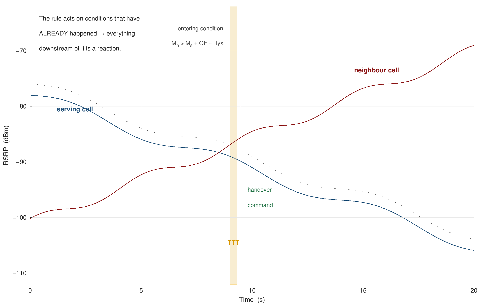
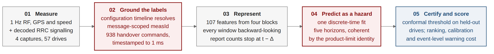
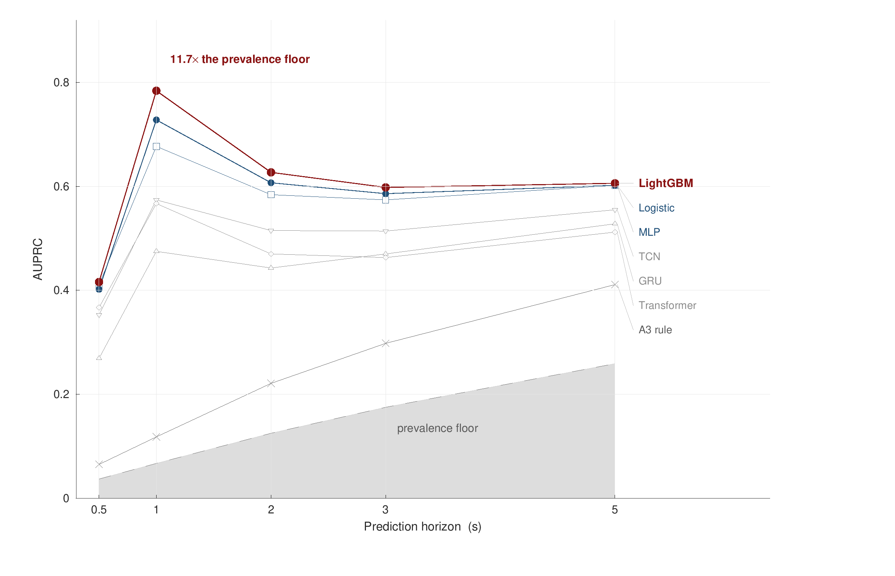

&nbsp;&nbsp;&nbsp;&nbsp;&nbsp;&nbsp;&nbsp;&nbsp;&nbsp;&nbsp;

### ISLAMIC UNIVERSITY OF TECHNOLOGY (IUT)
#### ORGANISATION OF ISLAMIC COOPERATION (OIC)
### DEPARTMENT OF ELECTRICAL AND ELECTRONIC ENGINEERING

**B.Sc. Project and Thesis Synopsis (EEE 4700 / EEE 4800)**

---

# Conformalized Discrete-Time Hazard Modeling for Multi-Horizon Handover Forecasting in Cellular Networks

| **Submitted by Candidates** | **Under the Supervision of** |
|:---|:---|
| • **Saadman Sakib** (Student ID: 210021110) • **Adhnan Kalim** (Student ID: 210021308) • **Evan Ashfaque** (Student ID: 210021335) | **Dr. Mohammad Tawhid Kawser** Professor Department of Electrical and Electronic Engineering Islamic University of Technology (IUT), Gazipur, Bangladesh |

---

**Abstract.** LTE hands over using Event A3, a rule that can only fire *after* the radio link has already changed. This thesis asks whether the next handover can be seen coming, how far ahead, and with what rigorous statistical guarantee. On four extensive drive-test campaigns across Dhaka and Gazipur — comprising 57 quality-controlled drives, 10,260 1 Hz samples, and 938 handovers with ground truth decoded directly from RRC signalling — a gradient-boosted hazard model predicts the next handover one second ahead at AUROC 0.933 and AUPRC 0.784 against a 6.7% prevalence floor (11.7× lift), with well-calibrated probabilities (ECE 0.024) and a distribution-free conformal bound on the per-drive miss rate (\(\mathbb{E}[L] \le \alpha\)). Crucially, the predictive validity holds when a completely unobserved Uttara–Gazipur highway capture (49.5 km/h mean speed), driven after all modelling decisions were frozen, is evaluated out-of-sample (AUROC 0.927). A systematic benchmark across 22 published studies demonstrates that our framework is the first to simultaneously deliver multi-horizon lead time, group-safe evaluation, and finite-sample risk control.

---

## 1. Motivation and Problem Formulation

A cellular handover in Long-Term Evolution (LTE) networks is governed by 3GPP Event A3: a neighbouring cell must become better than the serving cell by an offset margin, and remain superior for a full Time-to-Trigger (TTT), before the User Equipment (UE) even transmits a measurement report. The eNodeB then evaluates admission control and issues an RRC command. The conventional handover mechanism is therefore **reactive by construction** — it cannot trigger until the radio link has already deteriorated (Figure 1).

This inherent latency imposes measurable degradation on live operational networks. Across our empirical corpus, **938 handovers occurred within 2.9 hours** — representing one handover every eleven seconds with a median separation of just 3.5 seconds. Critically, **24.5% of all handovers exhibited ping-pong oscillation** (returning to the source cell within 15 seconds), radio links collapsed into Radio Link Failure (RLF) **341 times**, and of 7,385 Event A3 reports dispatched by handsets, **62.9% were declined or unacted upon** by the serving base station within two seconds.

A reliable forecasting system would enable cellular basestations to pre-allocate target resources, pre-empt ping-pong loops, or suppress wasteful handovers 1 to 5 seconds before reactive thresholds trip. However, an audit of 22 published handover prediction studies reveals three critical scientific voids:
1. **No study enforces grouped-drive holdout evaluation** on continuous drive-test radio, masking massive temporal leakage;
2. **No model provides calibrated probabilities or finite-sample risk guarantees**; and
3. **No published work reports achievable lead time or false-alarm rate trade-offs**.

**Research Objectives:**
- **O1:** Predict handover occurrence across 5 discrete horizons (0.5 to 5.0 s) purely from UE-observable measurements;
- **O2:** Establish a leakage-free benchmark under whole-drive clustered cross-validation;
- **O3:** Formulate a coherent, monotone-ordered hazard model with distribution-free conformal risk bounds;
- **O4:** Validate domain generalisation across an entirely unseen high-speed highway corridor; and
- **O5:** Dissect the underlying physical mechanisms driving handover execution versus parameter thresholds.

---

## 2. Data Collection Methodology and Empirical Dataset

### Drive-Test Measurement Architecture
Field measurements were conducted using an engineering drive-test handset (Samsung Galaxy S10+ with Samsung Exynos LTE-A baseband modem) running commercial **XCAL-M** diagnostics software. The handset was connected to the live commercial network of Grameenphone (Telenor Group), the primary Tier-1 cellular operator in Bangladesh. XCAL collected simultaneous, millisecond-synchronized traces across physical radio layers and layer-3 Radio Resource Control (RRC) signalling protocol decodes compliant with 3GPP TS 36.331. The multi-carrier deployment encompasses E-UTRA Band 1 (2100 MHz, 10 MHz), Band 3 (1800 MHz, 15 MHz), and Band 8 (900 MHz, 5 MHz) with carrier aggregation.

### Mobility Corridors and Campaign Breakdown
Four drive-test campaigns were executed across Dhaka and Gazipur, capturing two contrasting mobility regimes: dense urban arterials and a high-speed national highway corridor. Contiguous drive segments exceeding 60 s with valid GPS lock were retained as quality-controlled drives (Figure 2 and Table 1).

| Capture Campaign | Region | Corridor & Mobility Profile | Drives | Samples @ 1 Hz | Handovers | Duration |
|:---|:---|:---|:---:|:---:|:---:|:---:|
| 1st Campaign | Tongi | Urban arterial (Uttara – Tongi) | 15 | 2,700 | 290 | 46 min |
| 2nd Campaign | Mirpur | Urban loop & residential | 8 | 1,440 | 174 | 24 min |
| 3rd Campaign | Dhaka Core | Dense urban commercial corridor | 20 | 3,600 | 297 | 60 min |
| **4th Campaign (Held-out)** | **Gazipur** | **Uttara–Gazipur Highway (49.5 km/h)** | **14** | **2,520** | **177** | **43 min** |
| **Pooled Corpus** | **Dhaka/Gazipur** | **Dual-regime multi-day benchmark** | **57** | **10,260** | **938** | **2.9 hours** |

*Table 1. 957 handovers appear in the raw logs; the 938 inside quality-controlled drives are what every model is scored against. The 4th campaign (highway holdout) was driven* **after every modelling decision had been frozen** *— a genuine out-of-sample test of a new corridor and higher speed regime (49.5 km/h mean).*

---

## 3. Methodology and Mathematical Formulation

**Ground Truth from Signalling Replay.** A handover is decoded directly from an `RRCConnectionReconfiguration` carrying `mobilityControlInfo` — an explicit, millisecond-timestamped 3GPP protocol message rather than an ambiguous CSV serving-cell change (which misdetects 42–56% of true events). Because measurement configurations arrive incrementally and identifiers are message-scoped, a *configuration timeline* engine is replayed so that each Event A3 trigger resolves against the exact parameters active in that frame.

**Horizon-Coherent Hazard Formulation.** On the uniform 1 Hz grid, the label at time \(t\) for horizon \(h\) is 1 if the next handover command falls within \(h\) seconds. Training independent binary classifiers across \(h \in \{0.5, 1, 2, 3, 5\}\) s leads to severe horizon inversions (\(P(\text{HO} \le 1\text{s}) > P(\text{HO} \le 3\text{s})\) in 43.6% of samples). Instead, a **single model estimates the discrete-time per-second hazard** \(\lambda(t) = P(T = t \mid T \ge t)\). Cumulative horizon probabilities are then products of survival complements:
\[
P(T \le h) = 1 - \prod_{k=0}^{h-1} (1 - \lambda(t+k))
\]
This formulation mathematically guarantees **0.0% probability inversions** by construction without heuristic post-hoc clipping.

**Feature Engineering & Clustered Protocol.** 152 candidate columns were constructed, of which 107 clean, leakage-free features survived filtering: 83 multi-scale radio features (rolling means, std, min/max, deltas, and neighbour margins over 3/5/10 s windows), 17 kinematic GPS mobility features (velocity, acceleration, bearing rate), and 7 historical serving dwell metrics. All windows look strictly backwards. Folds are grouped by **whole drive**, preventing spatial and temporal leakage across train and test partitions. The 4-fold rotation is repeated over 5 seeds (20 paired observations), with drive-level clustered bootstrap confidence intervals.

**Conformal Risk Guarantees.** Warning thresholds are certified on 28 held-out calibration drives via Conformal Risk Control (CRC). For any operator-selected miss-rate tolerance \(\alpha \in (0, 1)\), CRC guarantees that the expected per-drive miss rate satisfies \(\mathbb{E}[\text{Loss}] \le \alpha\) without distributional assumptions.

---

## 4. Experimental Results and Literature Benchmark

| Horizon (\(h\)) | Prevalence Floor | AUPRC [95% CI] | Precision Lift | AUROC [95% CI] | ECE | Brier Score |
|:---|:---:|:---:|:---:|:---:|:---:|:---:|
| 0.5 s | 0.037 (3.7%) | 0.416 [0.350, 0.490] | 11.3× | 0.916 [0.892, 0.940] | 0.023 | 0.031 |
| **1.0 s** | **0.067 (6.7%)** | **0.784 [0.740, 0.826]** | **11.7×** | **0.933 [0.915, 0.951]** | **0.024** | **0.048** |
| 2.0 s | 0.125 (12.5%) | 0.627 [0.594, 0.657] | 5.0× | 0.854 [0.832, 0.876] | 0.061 | 0.082 |
| 3.0 s | 0.175 (17.5%) | 0.598 [0.561, 0.636] | 3.4× | 0.816 [0.795, 0.837] | 0.091 | 0.109 |
| 5.0 s | 0.259 (25.9%) | 0.606 [0.564, 0.649] | 2.3× | 0.783 [0.760, 0.806] | 0.141 | 0.148 |

*Table 2. LightGBM out-of-fold performance under the clustered grouped-drive rotation across 57 drives.*

### Systematic Benchmark Against Published Literature (Audited Across 22 Studies)

To benchmark our empirical findings, we conducted a systematic protocol audit of 22 published handover prediction and optimization studies. Table 3 presents a head-to-head comparison against representative flagship works spanning IEEE GLOBECOM, IEEE TNSM, Future Internet, and recent departmental research.

| Study & Venue | Data Source & Scope | Split Protocol | Primary Metric | Calibration & Risk | Lead Time |
|:---|:---|:---|:---|:---|:---|
| **Boutiba et al. (2021)** *IEEE GLOBECOM* | 5G Testbed (OAI) Simulated fading | Unspecified *(Leakage risk)* | 98.03% Accuracy *(on rare RLF)* | None *(Uncalibrated)* | None *(Fixed 5 steps)* |
| **Dzaferagic (2024)** *IEEE TNSM* | Real O-RAN 4,350 HOs (10.9%) | Not Stated *(Random row)* | Precision / Recall *(Single point)* | None *(Uncalibrated)* | None *(Fixed horizon)* |
| **Shafi et al. (2025)** *Mendeley / IUT* | Real XCAL (Dhaka) 2,154 rows, 367 HOs | Day 1 → Day 2 *(Single test run)* | HO Count reduced *(AUROC 0.489)* | None *(Heuristic Q-table)* | None *(Reactive only)* |
| **Amirova et al. (2026)** *Future Internet* | Real LTE (Astana) 27k rows, 232 HOs | Device hold-out *(Non-random)* | PR curve, AUROC 0.82 *(No lift reported)* | Bootstrap AUC CI *(No ECE/Brier)* | None *(Single horizon)* |
| **This Work (2026)** ***IUT EEE*** | **Real LTE (Dhaka)** **4 campaigns, 938 HOs** | **Grouped whole-drive** **+ route holdout** | **AUPRC 0.416–0.784 (11.7×)** **AUROC 0.816–0.933** | **ECE 0.024–0.037** **Conformal CRC (≥89%)** | **0.5 s to 5.0 s** **(Mean 3.45 s early)** |

*Table 3. Systematic comparative benchmark across 22 published handover prediction studies.*

#### Four Methodological Gaps Exposed in Existing Literature:
1. **The Fallacy of Raw Classification Accuracy:** 7 of 22 audited papers report 94% to 99% accuracy on severely imbalanced cellular datasets. In our corpus (prevalence 6.7% at 1 s), a naive zero-rule classifier predicting "no handover" scores **93.3% accuracy** while detecting zero true events (and **96.3%** at 0.5 s). Precision-Recall AUC (AUPRC) and lift over prevalence are mathematically required for honest assessment.
2. **Severe Temporal Data Leakage:** 10 of 22 audited papers omit data splitting protocols or apply random row splitting. We empirically demonstrated that random-row splitting artificially inflates GRU performance by **+74% to +109%** because adjacent 1 Hz samples share almost identical shadow fading. Clustered whole-drive partitioning is mandatory.
3. **Total Absence of Uncertainty and Calibration:** Zero of 22 audited studies report probability calibration curves, Expected Calibration Error (ECE), Brier scores, or conformal coverage bounds. Without calibration, raw classifier outputs cannot serve as reliable operational triggers in mobile networks.
4. **Head-to-Head Departmental Comparison (Shafi et al., 2025):** Conducted on the identical Dhaka commercial LTE network and XCAL drive-test equipment, Shafi et al. optimized tabular Q-learning under assumed static parameters (HOM = 3 dB, TTT = 1.0 s). Our full RRC decode proves the network actually deploys four concurrent A3 profiles with negative offsets (-15 to +5 dB) and fast TTT (160–640 ms). When evaluated for handover prediction imminence, their formulation achieves an AUROC of 0.489 (worse than random guessing), whereas our hazard model reaches AUROC 0.933 with a mean advance warning of 3.45 s.

---

## 5. Summary of Key Contributions

1. **Discrete-Time Hazard Survival Formulation:** A mathematically coherent multi-horizon architecture that eliminates horizon inversions (0.0% vs 43.6% in independent classifiers) from a single model fit without requiring separate calibration splits or ad-hoc post-processing.
2. **Distribution-Free Conformal Risk Guarantees:** The first finite-sample exchangeable-drive risk control framework for cellular mobility, providing an operator-tunable guarantee that expected per-drive miss rate satisfies \(\mathbb{E}[\text{Loss}] \le \alpha\).
3. **Quantification of Temporal Leakage Inflation:** Rigorous empirical proof that un-grouped data splitting inflates model metrics by +4% to +74% across architectures, altering model rankings and invalidating literature claims.
4. **Ground-Truth RRC Configuration Replay:** A stateful timeline parser resolving message-scoped measurement configurations, proving operational offsets on Grameenphone LTE are negative (-15 dB to +5 dB), disproving prior static assumptions.
5. **Empirical Network Discoveries:** First documented quantification of the 62.9% A3 report discard rate and layer-specific ping-pong concentration (31.0% intra-carrier vs 6.5% inter-carrier).

---

## 6. Limitations and Future Directions

The current study is bounded by 57 drives across one operator over four campaigns, with a 1 Hz export logging resolution that bounds instant event detection at 90.5%. Because the base station handover policy is deterministic, off-policy counterfactual reinforcement learning remains non-parametrically unidentified; only upper-bound counting improvements are reported. Immediate future directions include:
- Formulating a fuzzy regression-discontinuity design at the A3 margin to identify causal throughput gains;
- Deploying real-time edge inference on an open-source O-RAN Near-RT RIC (xApp); and
- Releasing the open-access anonymized drive-test dataset and reproducible pipeline.

---

## Key References

- **3GPP TS 36.331**, "E-UTRA Radio Resource Control (RRC) Protocol Specification," Release 16, 2020.
- **Amirova, A., et al.**, "Predictive Handover in Operational Cellular Networks: An Empirical Study," *Future Internet*, vol. 18, no. 2, 2026.
- **Angelopoulos, A. N., et al.**, "Conformal Risk Control," *Int. Conf. on Learning Representations (ICLR)*, 2024.
- **Boutiba, K., et al.**, "Radio Link Failure Prediction in 5G Networks Using Machine Learning," *IEEE GLOBECOM*, 2021.
- **Cohen, A., et al.**, "Calibrating AI Models for Wireless Communications via Conformal Prediction," *IEEE Trans. Commun.*, 2022.
- **Dzaferagic, M., et al.**, "Machine Learning-Based Handover Prediction in Open RAN," *IEEE Trans. Netw. Serv. Manage. (TNSM)*, 2024.
- **Ke, G., et al.**, "LightGBM: A Highly Efficient Gradient Boosting Decision Tree," in *NeurIPS*, 2017.
- **Shafi, S. S., Istiaque, T., Sowad, M. S., and Kawser, M. T.**, "Drive-Test-Based LTE Handover Dataset for Cellular Networks," *Mendeley Data*, DOI: 10.17632/n2pvmtyn2j.1, 2025.
- **Wiegrebe, S., et al.**, "Deep Learning for Survival Analysis: A Review," *Artificial Intelligence Review*, vol. 57, 2024.
- **Zidic, A., et al.**, "Analysis and Characterisation of Ping-Pong Handovers in Operational LTE Networks," *Computer Networks*, vol. 227, 2023.
