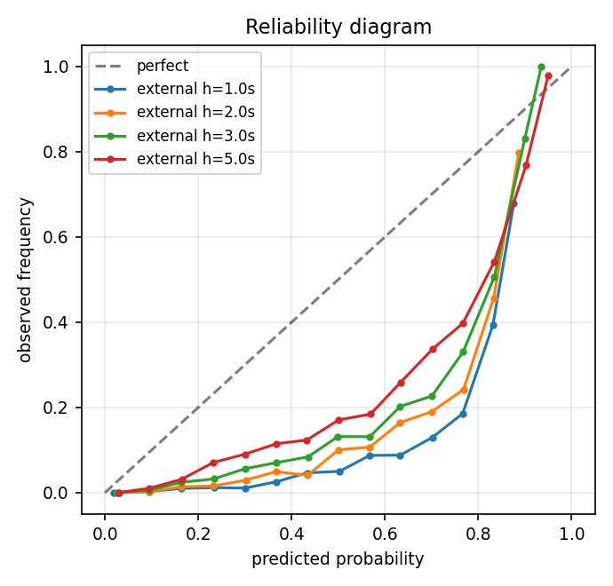
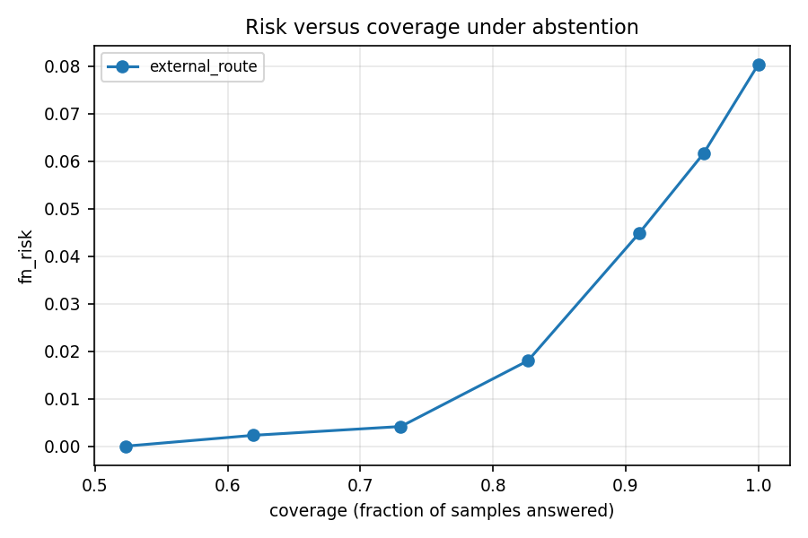

# Uncertainty-aware multi-horizon LTE handover and QoE forecasting - results

_Generated by the hoproj pipeline. Every number below is reproducible from `configs/` plus the staged raw capture._

## Provenance

- config fingerprint: `046a214f20ca`
- external route (locked): `kuril_badda_rampura_malibagh`
- horizons: [1.0, 2.0, 3.0, 5.0] s
- window length: 10.0 s
- environment: `3.11.15`, torch `2.14.0+cu130`

## Dataset

- **n_samples**: 81141
- **n_drives**: 117
- **n_routes**: 3
- **n_handovers**: 2300
- **pingpong_frac**: 0.07652173913043478
- **total_hours**: 22.506666666666668
- **total_km**: 722.9465776175371
- **unique_serving_cells**: 75
- **dates**: ['2026-09-06', '2026-09-07', '2026-09-08']

## Per route

_(no rows)_

## Label prevalence

_(no rows)_

## RQ1

**Do temporal models beat snapshot models across horizons?**

| model       | condition     | regime            | feature_set     | variant   |   horizon_s |    n |   positive_rate |   auprc |   auprc_lift |   auroc |   brier |    nll |    ece |   f1_best |   f1_best_threshold |   recall_at_fpr0.01 |   threshold_at_fpr0.01 |   recall_at_fpr0.05 |   threshold_at_fpr0.05 |   recall_at_fpr0.1 |   threshold_at_fpr0.1 |   precision_at_recall0.5 |   precision_at_recall0.8 |   auprc_point |   auprc_ci_low |   auprc_ci_high |   auprc_n_groups |   auprc_n_boot |   auprc_bootstrap_se |
|:------------|:--------------|:------------------|:----------------|:----------|------------:|-----:|----------------:|--------:|-------------:|--------:|--------:|-------:|-------:|----------:|--------------------:|--------------------:|-----------------------:|--------------------:|-----------------------:|-------------------:|----------------------:|-------------------------:|-------------------------:|--------------:|---------------:|----------------:|-----------------:|---------------:|---------------------:|
| rule        | grouped_drive | topology_agnostic | rf_mob_hist_qoe | base      |      1.0000 | 9106 |          0.0311 |  0.2136 |       6.8728 |  0.9135 |  0.3899 | 1.3826 | 0.5241 |    0.2840 |              0.9744 |              0.1307 |                 0.9982 |              0.3640 |                 0.9943 |             0.6643 |                0.9810 |                   0.1848 |                   0.1673 |        0.2136 |         0.1786 |          0.2531 |               14 |            300 |               0.0193 |
| rule        | grouped_drive | topology_agnostic | rf_mob_hist_qoe | base      |      2.0000 | 9092 |          0.0623 |  0.3432 |       5.5138 |  0.9070 |  0.3621 | 1.2568 | 0.4929 |    0.4329 |              0.9743 |              0.1360 |                 0.9979 |              0.3604 |                 0.9930 |             0.6837 |                0.9729 |                   0.3202 |                   0.2874 |        0.3432 |         0.2910 |          0.3882 |               14 |            300 |               0.0248 |
| rule        | grouped_drive | topology_agnostic | rf_mob_hist_qoe | base      |      3.0000 | 9079 |          0.0932 |  0.4300 |       4.6149 |  0.8990 |  0.3367 | 1.1480 | 0.4619 |    0.5201 |              0.9577 |              0.1253 |                 0.9976 |              0.3582 |                 0.9915 |             0.6844 |                0.9638 |                   0.4346 |                   0.3685 |        0.4300 |         0.3660 |          0.4832 |               14 |            300 |               0.0301 |
| rule        | grouped_drive | topology_agnostic | rf_mob_hist_qoe | base      |      5.0000 | 9052 |          0.1541 |  0.5484 |       3.5584 |  0.8835 |  0.2930 | 0.9742 | 0.4010 |    0.6107 |              0.9208 |              0.1025 |                 0.9974 |              0.3842 |                 0.9859 |             0.6695 |                0.9442 |                   0.5750 |                   0.4666 |        0.5484 |         0.4767 |          0.6084 |               14 |            300 |               0.0358 |
| logreg      | grouped_drive | topology_agnostic | rf_mob_hist_qoe | base      |      1.0000 | 9106 |          0.0311 |  0.3448 |      11.0950 |  0.9442 |  0.1011 | 0.3135 | 0.1524 |    0.4000 |              0.9019 |              0.2615 |                 0.9659 |              0.6007 |                 0.8558 |             0.8269 |                0.6787 |                   0.3310 |                   0.2153 |        0.3448 |         0.3129 |          0.3841 |               14 |            300 |               0.0185 |
| logreg      | grouped_drive | topology_agnostic | rf_mob_hist_qoe | base      |      2.0000 | 9092 |          0.0623 |  0.5453 |       8.7594 |  0.9451 |  0.1004 | 0.3102 | 0.1443 |    0.5278 |              0.8821 |              0.3039 |                 0.9605 |              0.6095 |                 0.8431 |             0.8269 |                0.6737 |                   0.5346 |                   0.3628 |        0.5453 |         0.5075 |          0.5802 |               14 |            300 |               0.0189 |
| logreg      | grouped_drive | topology_agnostic | rf_mob_hist_qoe | base      |      3.0000 | 9079 |          0.0932 |  0.6587 |       7.0692 |  0.9469 |  0.0982 | 0.3054 | 0.1357 |    0.6124 |              0.8231 |              0.3180 |                 0.9584 |              0.6383 |                 0.8333 |             0.8180 |                0.6648 |                   0.6580 |                   0.4682 |        0.6587 |         0.6241 |          0.6877 |               14 |            300 |               0.0157 |
| logreg      | grouped_drive | topology_agnostic | rf_mob_hist_qoe | base      |      5.0000 | 9052 |          0.1541 |  0.7801 |       5.0619 |  0.9469 |  0.0974 | 0.3036 | 0.1210 |    0.7088 |              0.7605 |              0.3799 |                 0.9516 |              0.6724 |                 0.8183 |             0.8265 |                0.6497 |                   0.8083 |                   0.6200 |        0.7801 |         0.7602 |          0.7965 |               14 |            300 |               0.0092 |
| lgbm        | grouped_drive | topology_agnostic | rf_mob_hist_qoe | base      |      1.0000 | 9106 |          0.0311 |  0.3621 |      11.6502 |  0.9427 |  0.0274 | 0.1174 | 0.0228 |    0.3951 |              0.0542 |              0.2686 |                 0.5648 |              0.6007 |                 0.0371 |             0.7915 |                0.0067 |                   0.3089 |                   0.2019 |        0.3621 |         0.3241 |          0.4109 |               14 |            300 |               0.0243 |
| lgbm        | grouped_drive | topology_agnostic | rf_mob_hist_qoe | base      |      2.0000 | 9092 |          0.0623 |  0.5665 |       9.1002 |  0.9483 |  0.0435 | 0.1638 | 0.0322 |    0.5450 |              0.2193 |              0.3233 |                 0.8460 |              0.6484 |                 0.1839 |             0.8322 |                0.0350 |                   0.5556 |                   0.3735 |        0.5665 |         0.5225 |          0.6277 |               14 |            300 |               0.0277 |
| lgbm        | grouped_drive | topology_agnostic | rf_mob_hist_qoe | base      |      3.0000 | 9079 |          0.0932 |  0.6721 |       7.2123 |  0.9510 |  0.0536 | 0.1961 | 0.0366 |    0.6334 |              0.3540 |              0.3475 |                 0.9250 |              0.6868 |                 0.3575 |             0.8239 |                0.0856 |                   0.6992 |                   0.4899 |        0.6721 |         0.6394 |          0.7148 |               14 |            300 |               0.0184 |
| lgbm        | grouped_drive | topology_agnostic | rf_mob_hist_qoe | base      |      5.0000 | 9052 |          0.1541 |  0.7991 |       5.1855 |  0.9544 |  0.0663 | 0.2307 | 0.0445 |    0.7157 |              0.3736 |              0.4000 |                 0.9554 |              0.7047 |                 0.5461 |             0.8401 |                0.1913 |                   0.8505 |                   0.6370 |        0.7991 |         0.7835 |          0.8175 |               14 |            300 |               0.0085 |
| gru         | grouped_drive | topology_agnostic | rf_mob_hist_qoe | base      |      1.0000 | 9106 |          0.0311 |  0.3590 |      11.5514 |  0.9464 |  0.0717 | 0.2073 | 0.0933 |    0.4139 |              0.8524 |              0.2367 |                 0.9343 |              0.6290 |                 0.7657 |             0.8269 |                0.5456 |                   0.3505 |                   0.2204 |        0.3590 |         0.3332 |          0.4060 |               14 |            300 |               0.0194 |
| gru         | grouped_drive | topology_agnostic | rf_mob_hist_qoe | base      |      2.0000 | 9092 |          0.0623 |  0.5526 |       8.8766 |  0.9496 |  0.0844 | 0.2528 | 0.0980 |    0.5448 |              0.8503 |              0.2809 |                 0.9605 |              0.6484 |                 0.8336 |             0.8392 |                0.6284 |                   0.5390 |                   0.3752 |        0.5526 |         0.5207 |          0.5880 |               14 |            300 |               0.0180 |
| gru         | grouped_drive | topology_agnostic | rf_mob_hist_qoe | base      |      3.0000 | 9079 |          0.0932 |  0.6645 |       7.1314 |  0.9516 |  0.0842 | 0.2552 | 0.0916 |    0.6262 |              0.7806 |              0.3014 |                 0.9631 |              0.6596 |                 0.8154 |             0.8522 |                0.6260 |                   0.6677 |                   0.4963 |        0.6645 |         0.6393 |          0.6903 |               14 |            300 |               0.0132 |
| gru         | grouped_drive | topology_agnostic | rf_mob_hist_qoe | base      |      5.0000 | 9052 |          0.1541 |  0.7826 |       5.0784 |  0.9519 |  0.0902 | 0.2808 | 0.0957 |    0.7197 |              0.7332 |              0.3763 |                 0.9646 |              0.6875 |                 0.8276 |             0.8466 |                0.6466 |                   0.8168 |                   0.6443 |        0.7826 |         0.7638 |          0.8028 |               14 |            300 |               0.0105 |
| tcn         | grouped_drive | topology_agnostic | rf_mob_hist_qoe | base      |      1.0000 | 9106 |          0.0311 |  0.3832 |      12.3285 |  0.9503 |  0.0855 | 0.2442 | 0.1187 |    0.4479 |              0.8861 |              0.2686 |                 0.9340 |              0.6466 |                 0.8219 |             0.8269 |                0.6234 |                   0.4034 |                   0.2328 |        0.3832 |         0.3489 |          0.4349 |               14 |            300 |               0.0221 |
| tcn         | grouped_drive | topology_agnostic | rf_mob_hist_qoe | base      |      2.0000 | 9092 |          0.0623 |  0.5603 |       9.0006 |  0.9514 |  0.0979 | 0.2885 | 0.1239 |    0.5703 |              0.8895 |              0.3057 |                 0.9571 |              0.6784 |                 0.8597 |             0.8304 |                0.6928 |                   0.5703 |                   0.3795 |        0.5603 |         0.5168 |          0.6098 |               14 |            300 |               0.0236 |
| tcn         | grouped_drive | topology_agnostic | rf_mob_hist_qoe | base      |      3.0000 | 9079 |          0.0932 |  0.6703 |       7.1939 |  0.9517 |  0.0955 | 0.2887 | 0.1143 |    0.6287 |              0.8682 |              0.3191 |                 0.9662 |              0.6749 |                 0.8556 |             0.8286 |                0.6694 |                   0.7013 |                   0.4916 |        0.6703 |         0.6347 |          0.7010 |               14 |            300 |               0.0177 |
| tcn         | grouped_drive | topology_agnostic | rf_mob_hist_qoe | base      |      5.0000 | 9052 |          0.1541 |  0.7836 |       5.0848 |  0.9504 |  0.0931 | 0.2860 | 0.1010 |    0.7119 |              0.7397 |              0.3713 |                 0.9597 |              0.6710 |                 0.8338 |             0.8366 |                0.6468 |                   0.8164 |                   0.6377 |        0.7836 |         0.7619 |          0.8028 |               14 |            300 |               0.0109 |
| transformer | grouped_drive | topology_agnostic | rf_mob_hist_qoe | base      |      1.0000 | 9106 |          0.0311 |  0.3780 |      12.1643 |  0.9503 |  0.0769 | 0.2154 | 0.1119 |    0.4379 |              0.7923 |              0.2827 |                 0.8902 |              0.6502 |                 0.7508 |             0.8410 |                0.5881 |                   0.3671 |                   0.2207 |        0.3780 |         0.3449 |          0.4332 |               14 |            300 |               0.0219 |
| transformer | grouped_drive | topology_agnostic | rf_mob_hist_qoe | base      |      2.0000 | 9092 |          0.0623 |  0.5723 |       9.1935 |  0.9524 |  0.0863 | 0.2444 | 0.1115 |    0.5590 |              0.8261 |              0.2951 |                 0.9216 |              0.6590 |                 0.7932 |             0.8375 |                0.6474 |                   0.5913 |                   0.3832 |        0.5723 |         0.5414 |          0.6163 |               14 |            300 |               0.0199 |
| transformer | grouped_drive | topology_agnostic | rf_mob_hist_qoe | base      |      3.0000 | 9079 |          0.0932 |  0.6848 |       7.3495 |  0.9538 |  0.0817 | 0.2350 | 0.0957 |    0.6331 |              0.7630 |              0.3345 |                 0.9145 |              0.6761 |                 0.7736 |             0.8404 |                0.6219 |                   0.7261 |                   0.5033 |        0.6848 |         0.6537 |          0.7154 |               14 |            300 |               0.0156 |
| transformer | grouped_drive | topology_agnostic | rf_mob_hist_qoe | base      |      5.0000 | 9052 |          0.1541 |  0.8017 |       5.2023 |  0.9551 |  0.0790 | 0.2373 | 0.0759 |    0.7217 |              0.7269 |              0.4086 |                 0.9053 |              0.7140 |                 0.7509 |             0.8430 |                0.6019 |                   0.8485 |                   0.6433 |        0.8017 |         0.7845 |          0.8181 |               14 |            300 |               0.0093 |

## RQ2

**Do they generalise to unseen drives and a held-out route?**

| model   | condition      |   horizon_s |     n |   positive_rate |   auprc |   auprc_lift |   auroc |   brier |    nll |    ece |   f1_best |   f1_best_threshold |   recall_at_fpr0.01 |   threshold_at_fpr0.01 |   recall_at_fpr0.05 |   threshold_at_fpr0.05 |   recall_at_fpr0.1 |   threshold_at_fpr0.1 |   precision_at_recall0.5 |   precision_at_recall0.8 |   auprc_point |   auprc_ci_low |   auprc_ci_high |   auprc_n_groups |   auprc_n_boot |   auprc_bootstrap_se |
|:--------|:---------------|------------:|------:|----------------:|--------:|-------------:|--------:|--------:|-------:|-------:|----------:|--------------------:|--------------------:|-----------------------:|--------------------:|-----------------------:|-------------------:|----------------------:|-------------------------:|-------------------------:|--------------:|---------------:|----------------:|-----------------:|---------------:|---------------------:|
| gru     | external_route |      1.0000 | 21784 |          0.0295 |  0.4055 |      13.7588 |  0.9506 |  0.0752 | 0.2239 | 0.1333 |    0.4292 |              0.7746 |              0.3240 |                 0.8220 |              0.6526 |                 0.7060 |             0.8271 |                0.5720 |                   0.3746 |                   0.2072 |        0.4055 |         0.3783 |          0.4376 |               33 |            300 |               0.0149 |
| gru     | external_route |      2.0000 | 21754 |          0.0589 |  0.5990 |      10.1646 |  0.9526 |  0.0844 | 0.2551 | 0.1404 |    0.5573 |              0.7864 |              0.3713 |                 0.8429 |              0.6591 |                 0.7301 |             0.8323 |                0.6082 |                   0.5908 |                   0.3624 |        0.5990 |         0.5708 |          0.6258 |               33 |            300 |               0.0146 |
| gru     | external_route |      3.0000 | 21723 |          0.0881 |  0.7085 |       8.0458 |  0.9549 |  0.0835 | 0.2549 | 0.1274 |    0.6329 |              0.7630 |              0.4088 |                 0.8560 |              0.6963 |                 0.7367 |             0.8416 |                0.6090 |                   0.7333 |                   0.4737 |        0.7085 |         0.6817 |          0.7320 |               33 |            300 |               0.0126 |
| gru     | external_route |      5.0000 | 21660 |          0.1441 |  0.8108 |       5.6252 |  0.9568 |  0.0859 | 0.2684 | 0.1188 |    0.7147 |              0.7207 |              0.4593 |                 0.8858 |              0.7149 |                 0.7541 |             0.8523 |                0.6097 |                   0.8560 |                   0.6351 |        0.8108 |         0.7908 |          0.8293 |               33 |            300 |               0.0099 |

## RQ3

**How much performance does random row splitting invent?**

| model   |   horizon_s |   grouped_drive |   random_row |   delta_grouped |   relative_inflation_grouped |
|:--------|------------:|----------------:|-------------:|----------------:|-----------------------------:|
| gru     |      1.0000 |          0.3590 |       0.5934 |          0.2344 |                       0.6529 |
| gru     |      2.0000 |          0.5526 |       0.8058 |          0.2532 |                       0.4582 |
| gru     |      3.0000 |          0.6645 |       0.8976 |          0.2331 |                       0.3508 |
| gru     |      5.0000 |          0.7826 |       0.9435 |          0.1609 |                       0.2056 |
| lgbm    |      1.0000 |          0.3621 |       0.3687 |          0.0066 |                       0.0183 |
| lgbm    |      2.0000 |          0.5665 |       0.5876 |          0.0211 |                       0.0372 |
| lgbm    |      3.0000 |          0.6721 |       0.7199 |          0.0478 |                       0.0711 |
| lgbm    |      5.0000 |          0.7991 |       0.8427 |          0.0435 |                       0.0545 |

## RQ4

**Does calibrated uncertainty with abstention cut high-risk errors?**

|   target_coverage |    tau |   realised_coverage |   n_accepted |   risk |   fn_risk |   fp_rate |   positive_rate_accepted |   auprc |
|------------------:|-------:|--------------------:|-------------:|-------:|----------:|----------:|-------------------------:|--------:|
|            1.0000 | 0.3478 |              1.0000 |    9092.0000 | 0.0656 |    0.3640 |    0.0457 |                   0.0623 |  0.5668 |
|            0.9500 | 0.1740 |              0.9464 |    8605.0000 | 0.0658 |    0.3284 |    0.0483 |                   0.0623 |  0.5836 |
|            0.9000 | 0.1245 |              0.8958 |    8145.0000 | 0.0654 |    0.2843 |    0.0510 |                   0.0618 |  0.6031 |
|            0.8000 | 0.0719 |              0.8060 |    7328.0000 | 0.0625 |    0.1826 |    0.0549 |                   0.0598 |  0.6401 |
|            0.7000 | 0.0391 |              0.7072 |    6430.0000 | 0.0523 |    0.0554 |    0.0521 |                   0.0533 |  0.6900 |
|            0.6000 | 0.0170 |              0.6090 |    5537.0000 | 0.0291 |    0.0086 |    0.0300 |                   0.0421 |  0.7432 |
|            0.5000 | 0.0081 |              0.5053 |    4594.0000 | 0.0065 |    0.0000 |    0.0066 |                   0.0065 |  0.6686 |

## RQ5

**Do mobility and QoE inputs add value over RF alone?**

| model   | condition     | regime            | feature_set     | variant   |   horizon_s |    n |   positive_rate |   auprc |   auprc_lift |   auroc |   brier |    nll |    ece |   f1_best |   f1_best_threshold |   recall_at_fpr0.01 |   threshold_at_fpr0.01 |   recall_at_fpr0.05 |   threshold_at_fpr0.05 |   recall_at_fpr0.1 |   threshold_at_fpr0.1 |   precision_at_recall0.5 |   precision_at_recall0.8 |   auprc_point |   auprc_ci_low |   auprc_ci_high |   auprc_n_groups |   auprc_n_boot |   auprc_bootstrap_se |   n_inputs |
|:--------|:--------------|:------------------|:----------------|:----------|------------:|-----:|----------------:|--------:|-------------:|--------:|--------:|-------:|-------:|----------:|--------------------:|--------------------:|-----------------------:|--------------------:|-----------------------:|-------------------:|----------------------:|-------------------------:|-------------------------:|--------------:|---------------:|----------------:|-----------------:|---------------:|---------------------:|-----------:|
| gru     | grouped_drive | topology_agnostic | rf              | base      |      1.0000 | 9106 |          0.0311 |  0.3624 |      11.6610 |  0.9496 |  0.0875 | 0.2479 | 0.1145 |    0.4169 |              0.8984 |              0.2756 |                 0.9306 |              0.6396 |                 0.8355 |             0.8375 |                0.6782 |                   0.3460 |                   0.2362 |        0.3624 |         0.3260 |          0.4123 |               14 |            300 |               0.0223 |         83 |
| gru     | grouped_drive | topology_agnostic | rf              | base      |      2.0000 | 9092 |          0.0623 |  0.5635 |       9.0519 |  0.9522 |  0.0956 | 0.2809 | 0.1161 |    0.5614 |              0.8691 |              0.3180 |                 0.9531 |              0.6731 |                 0.8656 |             0.8392 |                0.7212 |                   0.5527 |                   0.3782 |        0.5635 |         0.5231 |          0.6191 |               14 |            300 |               0.0242 |         83 |
| gru     | grouped_drive | topology_agnostic | rf              | base      |      3.0000 | 9079 |          0.0932 |  0.6849 |       7.3499 |  0.9544 |  0.0934 | 0.2781 | 0.1091 |    0.6395 |              0.8419 |              0.3475 |                 0.9559 |              0.6879 |                 0.8611 |             0.8511 |                0.7048 |                   0.7048 |                   0.5022 |        0.6849 |         0.6505 |          0.7231 |               14 |            300 |               0.0186 |         83 |
| gru     | grouped_drive | topology_agnostic | rf              | base      |      5.0000 | 9052 |          0.1541 |  0.8110 |       5.2627 |  0.9558 |  0.0880 | 0.2731 | 0.0912 |    0.7266 |              0.7761 |              0.4136 |                 0.9612 |              0.7090 |                 0.8500 |             0.8609 |                0.6490 |                   0.8580 |                   0.6598 |        0.8110 |         0.7880 |          0.8328 |               14 |            300 |               0.0114 |         83 |
| gru     | grouped_drive | topology_agnostic | rf+mob          | base      |      1.0000 | 9106 |          0.0311 |  0.3682 |      11.8482 |  0.9464 |  0.0533 | 0.1580 | 0.0779 |    0.4384 |              0.6952 |              0.2580 |                 0.8582 |              0.6396 |                 0.6118 |             0.8021 |                0.4280 |                   0.3734 |                   0.2064 |        0.3682 |         0.3392 |          0.4255 |               14 |            300 |               0.0222 |        100 |
| gru     | grouped_drive | topology_agnostic | rf+mob          | base      |      2.0000 | 9092 |          0.0623 |  0.5596 |       8.9886 |  0.9499 |  0.0702 | 0.2063 | 0.0870 |    0.5600 |              0.7353 |              0.3021 |                 0.9095 |              0.6696 |                 0.7168 |             0.8304 |                0.5314 |                   0.5652 |                   0.3710 |        0.5596 |         0.5251 |          0.6142 |               14 |            300 |               0.0231 |        100 |
| gru     | grouped_drive | topology_agnostic | rf+mob          | base      |      3.0000 | 9079 |          0.0932 |  0.6679 |       7.1672 |  0.9508 |  0.0686 | 0.2073 | 0.0707 |    0.6238 |              0.6599 |              0.3132 |                 0.9185 |              0.6631 |                 0.6990 |             0.8392 |                0.4846 |                   0.6835 |                   0.4949 |        0.6679 |         0.6420 |          0.7020 |               14 |            300 |               0.0159 |        100 |
| gru     | grouped_drive | topology_agnostic | rf+mob          | base      |      5.0000 | 9052 |          0.1541 |  0.7936 |       5.1496 |  0.9515 |  0.0752 | 0.2353 | 0.0661 |    0.7261 |              0.5661 |              0.3763 |                 0.9293 |              0.6989 |                 0.7141 |             0.8545 |                0.5074 |                   0.8329 |                   0.6592 |        0.7936 |         0.7796 |          0.8060 |               14 |            300 |               0.0067 |        100 |
| gru     | grouped_drive | topology_agnostic | rf+mob+hist     | base      |      1.0000 | 9106 |          0.0311 |  0.3487 |      11.2194 |  0.9503 |  0.0887 | 0.2524 | 0.1314 |    0.4353 |              0.8490 |              0.2367 |                 0.9133 |              0.6643 |                 0.7952 |             0.8551 |                0.6425 |                   0.3614 |                   0.2288 |        0.3487 |         0.3222 |          0.3952 |               14 |            300 |               0.0197 |        107 |
| gru     | grouped_drive | topology_agnostic | rf+mob+hist     | base      |      2.0000 | 9092 |          0.0623 |  0.5471 |       8.7877 |  0.9520 |  0.1026 | 0.2972 | 0.1362 |    0.5641 |              0.8648 |              0.2774 |                 0.9414 |              0.6802 |                 0.8543 |             0.8357 |                0.7335 |                   0.5899 |                   0.3953 |        0.5471 |         0.5092 |          0.5986 |               14 |            300 |               0.0227 |        107 |
| gru     | grouped_drive | topology_agnostic | rf+mob+hist     | base      |      3.0000 | 9079 |          0.0932 |  0.6769 |       7.2641 |  0.9540 |  0.0987 | 0.2909 | 0.1242 |    0.6358 |              0.8028 |              0.3073 |                 0.9471 |              0.6891 |                 0.8550 |             0.8487 |                0.7218 |                   0.7090 |                   0.5244 |        0.6769 |         0.6506 |          0.7080 |               14 |            300 |               0.0148 |        107 |
| gru     | grouped_drive | topology_agnostic | rf+mob+hist     | base      |      5.0000 | 9052 |          0.1541 |  0.7922 |       5.1403 |  0.9548 |  0.0950 | 0.2907 | 0.1126 |    0.7316 |              0.8022 |              0.3577 |                 0.9490 |              0.7133 |                 0.8441 |             0.8552 |                0.6937 |                   0.8274 |                   0.6723 |        0.7922 |         0.7744 |          0.8104 |               14 |            300 |               0.0096 |        107 |
| gru     | grouped_drive | topology_agnostic | rf+mob+hist+qoe | base      |      1.0000 | 9106 |          0.0311 |  0.3590 |      11.5514 |  0.9464 |  0.0717 | 0.2073 | 0.0933 |    0.4139 |              0.8524 |              0.2367 |                 0.9343 |              0.6290 |                 0.7657 |             0.8269 |                0.5456 |                   0.3505 |                   0.2204 |        0.3590 |         0.3332 |          0.4060 |               14 |            300 |               0.0194 |        138 |
| gru     | grouped_drive | topology_agnostic | rf+mob+hist+qoe | base      |      2.0000 | 9092 |          0.0623 |  0.5526 |       8.8766 |  0.9496 |  0.0844 | 0.2528 | 0.0980 |    0.5448 |              0.8503 |              0.2809 |                 0.9605 |              0.6484 |                 0.8336 |             0.8392 |                0.6284 |                   0.5390 |                   0.3752 |        0.5526 |         0.5207 |          0.5880 |               14 |            300 |               0.0180 |        138 |
| gru     | grouped_drive | topology_agnostic | rf+mob+hist+qoe | base      |      3.0000 | 9079 |          0.0932 |  0.6645 |       7.1314 |  0.9516 |  0.0842 | 0.2552 | 0.0916 |    0.6262 |              0.7806 |              0.3014 |                 0.9631 |              0.6596 |                 0.8154 |             0.8522 |                0.6260 |                   0.6677 |                   0.4963 |        0.6645 |         0.6393 |          0.6903 |               14 |            300 |               0.0132 |        138 |
| gru     | grouped_drive | topology_agnostic | rf+mob+hist+qoe | base      |      5.0000 | 9052 |          0.1541 |  0.7826 |       5.0784 |  0.9519 |  0.0902 | 0.2808 | 0.0957 |    0.7197 |              0.7332 |              0.3763 |                 0.9646 |              0.6875 |                 0.8276 |             0.8466 |                0.6466 |                   0.8168 |                   0.6443 |        0.7826 |         0.7638 |          0.8028 |               14 |            300 |               0.0105 |        138 |

## RQ6

**Does candidate ranking transfer to unseen cells?**

_`external_route_target_ranking` not produced yet_

## RQ7

**Is a compact GRU/TCN competitive with a Transformer?**

| model       | device   |   batch_size |   latency_ms_mean |   latency_ms_p50 |   latency_ms_p95 |   per_sample_ms |   predictions_per_second |   n_parameters |   n_trainable |   state_size_mb |
|:------------|:---------|-------------:|------------------:|-----------------:|-----------------:|----------------:|-------------------------:|---------------:|--------------:|----------------:|
| gru         | cpu      |            1 |            0.5081 |           0.5152 |           0.5473 |          0.5081 |                1968.1889 |         130500 |        130500 |          0.4978 |
| gru         | cpu      |           32 |            1.3263 |           1.3046 |           1.4283 |          0.0414 |               24127.9645 |         130500 |        130500 |          0.4978 |
| gru         | cpu      |          256 |            5.6701 |           5.6541 |           5.8939 |          0.0221 |               45149.4874 |         130500 |        130500 |          0.4978 |
| tcn         | cpu      |            1 |            0.7005 |           0.6950 |           0.7736 |          0.7005 |                1427.6510 |         101764 |        101764 |          0.3882 |
| tcn         | cpu      |           32 |            1.8038 |           1.8129 |           1.8631 |          0.0564 |               17740.5812 |         101764 |        101764 |          0.3882 |
| tcn         | cpu      |          256 |            7.4966 |           7.3203 |           8.3626 |          0.0293 |               34148.9897 |         101764 |        101764 |          0.3882 |
| transformer | cpu      |            1 |            0.7071 |           0.6618 |           1.2152 |          0.7071 |                1414.2516 |         169572 |        169572 |          0.8344 |
| transformer | cpu      |           32 |            1.5043 |           1.4928 |           1.5885 |          0.0470 |               21272.6934 |         169572 |        169572 |          0.8344 |
| transformer | cpu      |          256 |            6.1966 |           6.1085 |           6.6309 |          0.0242 |               41313.1024 |         169572 |        169572 |          0.8344 |

## Figures

## Reproducibility checklist

- [x] splits are by complete drive and complete route; random-row splitting exists only as a control
- [x] scaling, imputation, feature pruning and QoE thresholds are fitted on training drives only
- [x] calibration and abstention thresholds come from dedicated calibration drives
- [x] the external route is gated behind a freeze manifest
- [x] confidence intervals and tests resample drives, not rows
- [x] event-level metrics count each physical handover once and report false alarms per hour and per km
- [ ] trained checkpoints and de-identified data attached for release (run stage 06)
